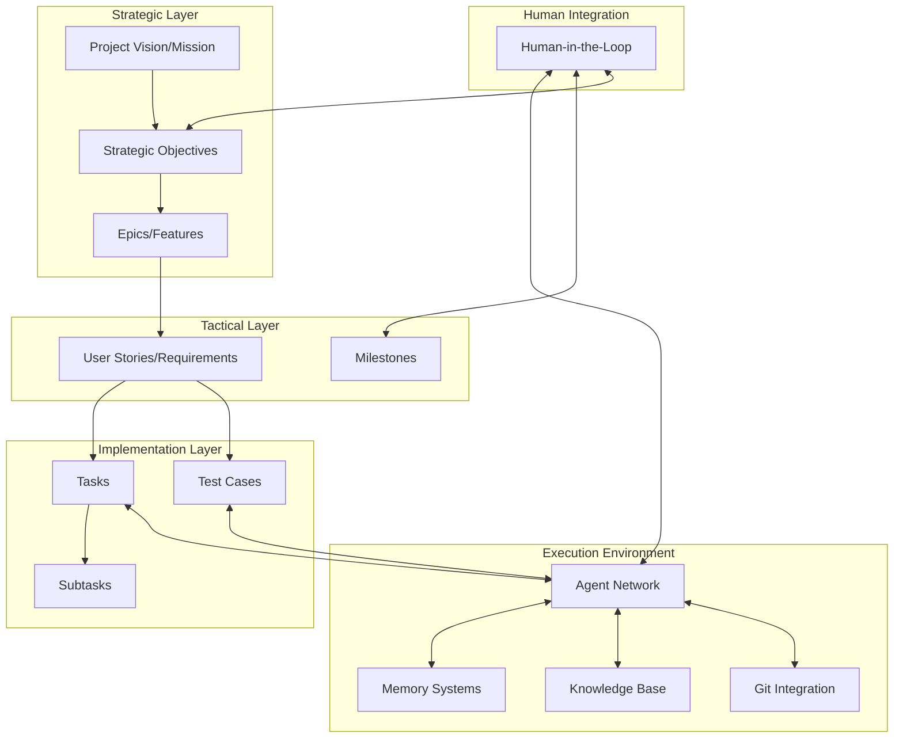
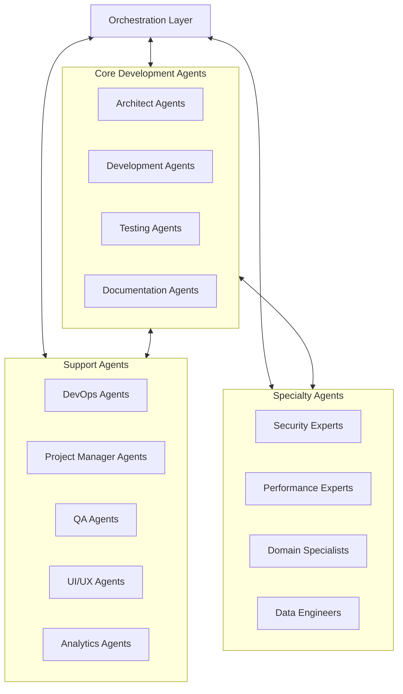
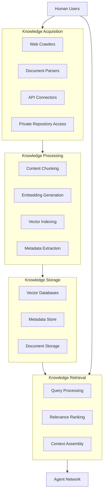
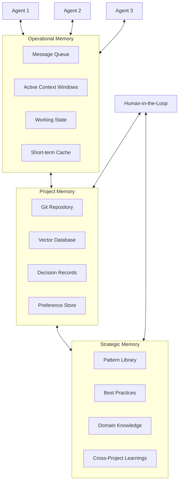
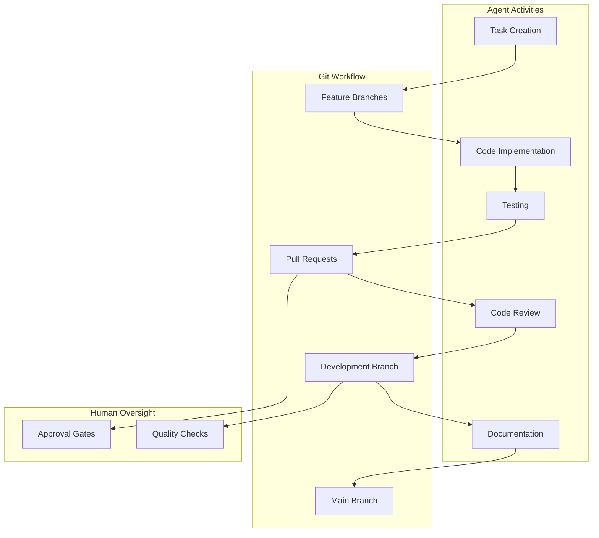
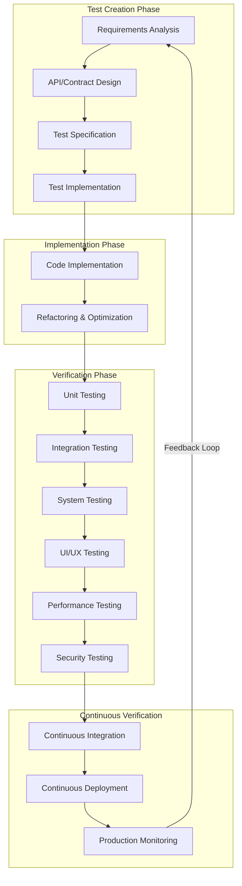
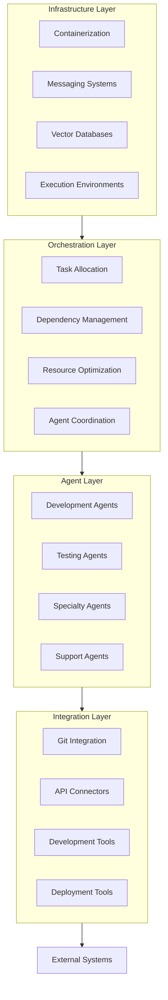
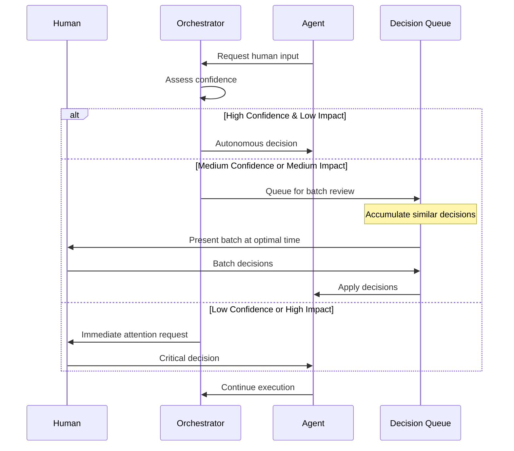

# Ōtobotto: An Autonomous AI Swarm Architecture for Enterprise Software Development

## Abstract

This paper presents Ōtobotto, a novel autonomous AI swarm architecture designed for enterprise-grade software development. By integrating modern software project management principles with distributed AI agent coordination, Ōtobotto creates a robust system capable of handling complex software projects across diverse technology stacks. The architecture incorporates Git-native workflows, comprehensive test-driven development practices, and adaptive human-in-the-loop strategies to maintain quality while maximizing productivity. This paper outlines the core components, technical implementation considerations, and potential applications of the Ōtobotto system, providing a framework for future development of autonomous software engineering systems.

## 1. Introduction

As software systems grow increasingly complex, traditional development methodologies face significant challenges in maintaining quality, timeline adherence, and budgetary constraints. Concurrently, Large Language Models (LLMs) have demonstrated remarkable capabilities in code generation, problem-solving, and technical reasoning. Ōtobotto leverages these capabilities through a coordinated swarm of specialized AI agents operating within a structured framework designed to mirror established software development best practices.

Unlike single-agent approaches, Ōtobotto employs a multi-agent architecture where specialized components work in concert, enabling parallel development, cross-verification, and continuous integration throughout the development lifecycle. By combining the strengths of AI with proven software engineering methodologies, Ōtobotto aims to create an autonomous system capable of delivering enterprise-grade software while maintaining appropriate human oversight.

### 1.1 Differentiation from Existing Solutions

Ōtobotto distinguishes itself from current AI coding assistants and multi-agent systems through several key architectural distinctions. At its core, the system implements true swarm coordination rather than sequential agent handoffs, embedding Git-native workflows directly into the architecture. Test-driven development serves as a fundamental principle rather than an afterthought, while enterprise integration capabilities are designed into the system from the ground up.

From a technical perspective, Ōtobotto offers sophisticated memory hierarchy that goes well beyond simple vector storage, coupled with adaptive token optimization for efficient cost management. The system's cross-language expertise leverages technology-agnostic patterns, all protected by comprehensive security and compliance frameworks that address enterprise concerns.

Operationally, the system achieves a careful balance of human integration with minimal interruption to workflow, providing explainable decision-making throughout the development process. This approach delivers measurable productivity and quality improvements while implementing a progressive autonomy model that builds trust over time through demonstrated reliability.

### 1.2 Enterprise Focus

Ōtobotto is specifically designed for complex enterprise software environments where traditional approaches struggle with scale and complexity. The system provides robust support for diverse legacy and modern technology stacks, seamlessly integrating with existing enterprise systems and platforms. Compliance with industry-specific regulations is built into the core architecture, enabling deployment in highly regulated sectors. The system scales effectively for large, distributed development teams and supports sophisticated project management methodologies that enterprise organizations rely on for governance and oversight.

## 2. Background and Motivation

### 2.1 Challenges in Complex Software Development

Enterprise software development faces numerous challenges that have proven resistant to traditional solutions. The increasing system complexity requires diverse expertise that is difficult to coordinate effectively, while knowledge fragmentation across team members creates silos that impede progress. As projects scale, maintaining coherence becomes exponentially more difficult, creating tension between innovation needs and standardization requirements. Technical debt accumulates over long project lifecycles, further complicating maintenance and evolution of critical systems.

### 2.2 Limitations of Current AI Approaches

While LLMs have shown promise in code generation, several limitations persist that prevent them from addressing enterprise needs. Context window constraints fundamentally limit system understanding, while the lack of persistent memory across sessions creates discontinuity in development. Current approaches struggle to coordinate multiple aspects of complex projects simultaneously, leading to inconsistent testing and validation practices. Perhaps most critically, maintaining architectural integrity across large codebases remains a significant challenge for existing AI solutions.

### 2.3 The Case for AI Swarms

Ōtobotto addresses these limitations through a swarm-based approach that fundamentally reimagines AI-assisted development. By distributing responsibilities across specialized agents, the system creates a division of labor that mirrors successful human teams. Shared context is maintained through structured memory systems that persist across sessions, while comprehensive verification occurs at multiple levels to ensure quality. The architecture follows established software development practices rather than reinventing methodologies, providing appropriate human touchpoints for guidance and oversight when needed.

## 3. Evolving AI Capabilities and Global Competition

### 3.1 International AI Race and Model Advancement

The development of foundation models is accelerating through intensifying global competition, particularly between the United States, China, and Europe. This competition is driving rapid advancements that directly enable Ōtobotto's vision.

North American advancements have been substantial, with OpenAI's progression from GPT-4 to more sophisticated successors establishing new benchmarks for reasoning capabilities. Anthropic's Claude models have demonstrated enhanced reasoning and task planning capabilities that enable complex software development tasks. Google's Gemini models have pushed context windows beyond 2 million tokens, while Meta's open-source LLaMA and Llama family have democratized access to powerful models that can be fine-tuned for specialized tasks.

Chinese innovation has contributed significantly to the field, with DeepSeek R1's breakthrough capabilities in reasoning and code generation showing particular promise for software development applications. Monica's Manus system has demonstrated general AI agency across diverse tasks, while Baidu's ERNIE models advance multilingual and multimodal capabilities essential for global development teams. Moonshot AI's rapid progress in agent architectures offers new approaches to coordination problems.

European contributions have focused on efficiency and governance, with Mistral AI's efficient model architecture providing performance advantages for resource-constrained environments. Aleph Alpha's focus on sovereign AI with strong governance addresses regulatory concerns, while various open-source initiatives enhance transparency and accessibility. European regulatory frameworks are shaping responsible AI development practices that inform Ōtobotto's compliance approach.

This global race is creating a rapidly evolving foundation for systems like Ōtobotto, with each advancement making autonomous development increasingly feasible.

### 3.2 Critical Technological Breakthroughs

Several key technological advancements are enabling Ōtobotto's approach to autonomous software development. The evolution of context windows from 8K tokens to 32K, 128K, and now beyond 2M tokens has eliminated traditional limitations that hampered long-term reasoning. This expanded capacity allows models to hold entire codebases in context during development while maintaining an understanding of project history and dependencies.

Advanced reasoning capabilities have emerged through techniques like Chain-of-Thought and Tree-of-Thought reasoning, complemented by self-critique and recursive improvement methodologies. Multimodal reasoning across code, diagrams, and natural language enables holistic understanding of software artifacts, while higher-order planning and task decomposition allow for tackling complex projects systematically.

Agent autonomy has improved dramatically through tool use sophistication and self-correction mechanisms. Memory management and recall enhancements enable persistent understanding across sessions, while planning horizon extension and goal persistence maintain focus on long-term objectives. Meta-cognitive capabilities for self-regulation allow agents to monitor and adjust their own performance.

Training methodologies have evolved significantly, with Reinforcement Learning from Human Feedback (RLHF) refinements improving alignment with developer expectations. Reinforcement Learning from AI Feedback (RLAIF) scaling mechanisms enable more efficient training, while constitutional AI approaches ensure alignment with human values. Domain-specific fine-tuning techniques allow for specialization in software development tasks.

### 3.3 Implications for Ōtobotto

These advancements create unprecedented opportunities for the Ōtobotto system to transform software development. Enhanced capabilities enable project decomposition from initial brief to comprehensive roadmap, coordinated specialist work across diverse technology domains, sustained focus on long-running projects with consistent quality, and proactive initiative taking with appropriate human oversight.

The accelerating feasibility of autonomous development means capabilities that seemed years away are becoming possible within months. System components can leverage increasingly powerful foundation models as they emerge, while implementation complexity is reduced as models handle more sophisticated reasoning tasks. Economic viability improves with greater model efficiency and capability, making the business case for Ōtobotto increasingly compelling.

The future trajectory shows no signs of slowing, with international competition ensuring continued investment and innovation. Open-source efforts democratize access to powerful capabilities that can be incorporated into the Ōtobotto framework, while integration of specialized and general capabilities creates new possibilities for autonomous development.

The rapid evolution of underlying AI capabilities makes Ōtobotto not only increasingly feasible but positions it at the forefront of a transformation in how complex software is conceived, developed, and maintained. What follows is an architecture designed to leverage these advancements while remaining adaptable to the continued evolution of foundation models.

## 4. Architecture Overview

Ōtobotto's architecture is designed to mirror proven software project management techniques while adapting them to an AI-native context. The system follows a hierarchical decomposition approach that maintains coherence from high-level objectives to individual implementation tasks.

### 3.1 Strategic Fundamentals

The strategic foundation of Ōtobotto rests on four core principles that guide all development activities. Vision and mission alignment ensures clear articulation of project goals that drive all development decisions, creating coherence across the system. Architectural integrity is maintained through established principles that ensure technical coherence even as the system scales. Risk management occurs through proactive identification and mitigation strategies that address potential issues before they impact development. Quality assurance is embedded throughout the development lifecycle rather than applied as an afterthought, ensuring consistent results.

### 3.2 Project Decomposition Hierarchy

Ōtobotto implements a seven-level decomposition hierarchy that enables systematic breakdown of complex projects. At the highest level, the project vision and mission provide the overarching purpose driving all decisions. Strategic objectives define high-level goals aligned with business value, which are then broken down into epics and features representing major functionality groups with measurable outcomes. User stories and requirements provide user-centered functionality descriptions that connect technical work to business needs. Milestones establish key achievement points with clear evaluation criteria, while tasks define implementation-ready work items with clear acceptance criteria. At the most granular level, subtasks represent work units that can be individually assigned and verified.

### 3.3 AI-Native Adaptations

Ōtobotto adapts traditional methodologies to an AI-native context through several innovative approaches. Computation-based units replace human-oriented timeframes with metrics based on processing cycles, token consumption, and task completion, creating more predictable planning. Git-native operations provide direct integration with version control principles including branching strategies, pull requests, and code review, ensuring software engineering best practices are followed. Test-driven development is implemented through specialized agents focused on test creation before implementation, maintaining quality throughout the process. Cost optimization occurs through dynamic resource allocation based on task complexity and budget constraints, ensuring efficient use of computational resources.

### 3.4 Dashboard-First, KPI-Driven Development

Ōtobotto implements a dashboard-first approach to project management that emphasizes measurable outcomes from the beginning. Centralized dashboards display key performance indicators in real-time, providing visibility into development progress. All development activities are linked to measurable objectives, ensuring alignment with business goals. Data-driven insights guide both AI and human decision-making, while automated collection and analysis of performance data creates a continuous feedback loop for improvement.

The system integrates with various dashboard platforms to provide comprehensive visibility. Grafana enables real-time monitoring and alerting for system performance, while Looker Studio provides business intelligence for strategic decision-making. Tableau offers advanced data visualization for complex analytics, and Power BI delivers enterprise reporting and trend analysis. Custom dashboards can be created for project-specific visualizations of specialized metrics.

Core KPI categories span multiple dimensions of project performance. Development velocity metrics track story points completed, code output, and iteration cycles. Quality metrics monitor test coverage, defect density, and technical debt accumulation. Business value metrics assess feature adoption, user engagement, and revenue impact. Resource utilization metrics track token consumption, compute efficiency, and cost per feature. User satisfaction metrics include NPS (Net Promoter Score), CSAT, and user feedback analysis. ESG metrics cover environmental factors like energy efficiency and carbon footprint, social considerations such as accessibility compliance and inclusive design practices, and governance aspects including ethical AI principles adherence and bias mitigation.

### 3.5 Planning-First Methodology

Ōtobotto prioritizes thorough planning before implementation, ensuring that projects are well-conceived before coding begins. The architecture design phase provides comprehensive system design before code implementation, establishing a solid foundation. Documentation generation occurs automatically, creating architectural documents that guide development. A structured goal definition framework ensures measurable objectives are established early, while feedback collection infrastructure gathers and processes user input throughout the project. Built-in mechanisms for measuring and enhancing performance create a continuous improvement loop that refines the system over time.

## 4. Core Components

### 4.1 Orchestration Layer

At the heart of Ōtobotto lies the orchestration layer, a central coordination system that manages task allocation, dependency resolution, and agent communication. This sophisticated component implements priority-based work distribution that ensures critical tasks are addressed first, while task dependency management maintains proper sequencing of interdependent work. Resource optimization allocates computational resources efficiently based on task requirements, and progress monitoring provides real-time visibility into development status. When agents propose competing solutions, conflict resolution mechanisms determine the optimal approach based on established criteria.

### 4.2 Agent Network

The agent network comprises specialized AI agents with defined roles that form the core workforce of the Ōtobotto system. This flexible architecture can be extended with additional specialized agents as project needs evolve.

Architect agents handle system design and technical decision-making, establishing the foundation for development work. Development agents implement functionality across various technology stacks, from frontend interfaces to backend services. Testing agents design, execute, and validate tests to ensure quality, while documentation agents manage code documentation and knowledge capture. DevOps agents handle build, deployment, and infrastructure management, ensuring smooth operation of the development pipeline.

Project manager agents coordinate tasks, manage timelines, and allocate resources efficiently. QA agents provide quality assurance beyond testing, including usability assessment and user experience evaluation. UI/UX agents design interfaces and optimize user experiences, while analytics agents analyze data and report on metrics. ESG compliance agents assess environmental impact, verify accessibility, and address ethical considerations throughout the development process.

Security agents perform vulnerability assessment, compliance verification, and threat modeling to protect systems. Governance agents ensure regulatory compliance, prepare audit documentation, and enforce policy requirements. Specialty agents provide domain-specific expertise for industry verticals and performance optimization tasks that require specialized knowledge.

### 4.3 Knowledge Infrastructure

#### 4.3.1 Retrieval-Augmented Generation (RAG) System

Ōtobotto implements a robust knowledge acquisition and processing system that enhances agent capabilities through contextual information. Documentation crawlers specialized by source type gather information from various repositories, while enterprise knowledge connectors access private repositories securely. Domain-specific research agents gather specialized information relevant to project needs, and structured knowledge representation ensures effective retrieval when needed.

#### 4.3.2 Hierarchical Memory System

The system implements a three-tiered memory architecture that addresses different temporal needs. Operational memory provides short-term storage for real-time agent communication and context, enabling immediate collaboration. Project memory serves as mid-term storage for project-specific knowledge and decisions that persist throughout the development lifecycle. Strategic memory provides long-term storage for patterns, best practices, and cross-project learnings that accumulate over time.

#### 4.3.3 Regulatory Knowledge Base

The system maintains a specialized knowledge repository for industry regulations that ensures compliance across various domains. This includes comprehensive information on industry-specific regulations for banking, healthcare, transportation, and other regulated sectors. Regional compliance requirements such as GDPR, HIPAA, SOC2, and ISO standards are tracked and applied as needed. Automated monitoring of changing regulations ensures the system remains current with evolving requirements, while automated checks verify compliance throughout the development process. The system generates compliance documentation for auditing purposes, simplifying regulatory reviews.

### 4.4 Git Integration Layer

Ōtobotto provides direct integration with version control systems, embedding software engineering best practices into the development process. Automated branch management enables parallel development across multiple features simultaneously, while pull request lifecycle automation streamlines code review and integration. Code review and approval workflows ensure quality standards are maintained, and issue/ticket integration connects development activities to work tracking systems.

### 4.5 Testing and Verification Framework

Ōtobotto implements a comprehensive test-driven development approach that ensures quality throughout the development process. Contract design and test specification occur before implementation, establishing clear expectations for functionality. Multi-level testing spans unit, integration, and system levels to verify behavior at different scopes. Specialized frontend/UI testing solutions address the unique challenges of user interfaces, while performance and security verification ensure non-functional requirements are met.

### 4.6 Support and Maintenance System

Ōtobotto provides comprehensive infrastructure for long-term project support beyond initial development. Ticketing system integration enables automated issue tracking and prioritization, ensuring efficient handling of support requests. A structured user support workflow manages user requests systematically, while continuous monitoring tracks system performance in real-time. Automated updates handle scheduled maintenance and feature deployments with minimal disruption. Knowledge base management maintains user-facing documentation and help resources, while historical analysis identifies trends for proactive problem resolution.

## 5. Technical Implementation

### 5.1 Containerization and Execution Environments

Ōtobotto requires secure, scalable environments for agent operation. The system leverages Kubernetes orchestration for container management, deployment, and scaling, providing enterprise-grade reliability. E2B environments offer ephemeral, secure execution with fast spin-up times for isolated task execution, while WebAssembly sandboxing provides lightweight containerization for code execution and testing. Secure execution boundaries prevent unintended system interactions, protecting sensitive resources. Dynamic resource allocation scales based on computational requirements, optimizing resource usage. Energy-efficient orchestration implements scheduling optimizations that minimize resource usage and carbon footprint, aligning with sustainability goals.

### 5.2 Inter-Agent Communication

The system implements robust messaging infrastructure that enables agent coordination across distributed environments. Kafka and RabbitMQ provide high-throughput distributed message queues for reliable delivery, ensuring no communication is lost. Inngest serves as an event-driven workflow engine for coordinating complex multi-step processes, while Upstash offers serverless data solutions for Redis and Kafka that simplify operations. NATS provides lightweight, high-performance messaging for time-sensitive communications. State synchronization mechanisms maintain shared understanding across agents, while prioritization protocols handle messages based on task importance and dependencies.

### 5.3 Vector Databases for Long-Term Memory

Ōtobotto employs semantic storage solutions for code understanding and knowledge retrieval, evaluating options based on performance, sustainability, and project requirements. Pinecone offers a managed vector database with high availability and scalability for enterprise deployments. Weaviate provides an open-source vector search engine with multi-modal capabilities for diverse content types. FAISS delivers Facebook AI Similarity Search for efficient similarity operations, while Milvus offers open-source vector database capabilities with advanced filtering. Chroma is purpose-built for AI applications with embedding storage optimizations, and Qdrant provides vector database functionality optimized for extended filtering operations. LanceDB offers a lightweight vector database with columnar storage for efficient queries, while Pgvector extends PostgreSQL with vector similarity search capabilities.

For embedding generation, the system evaluates multiple options to find the optimal approach for each use case. OpenAI Embeddings provide high-quality commercial embedding generation with state-of-the-art performance. Cohere Embeddings offer an alternative commercial provider with strong multilingual capabilities. Sentence Transformers include open-source embedding models like MPNet and BERT that can be deployed locally. BGE Embeddings are optimized for specialized retrieval tasks with domain-specific knowledge. Local embedding models provide self-hosted options for sensitive data scenarios where privacy is paramount. E5 Embeddings from Microsoft offer efficient embedding generation with strong performance characteristics.

### 5.4 Information Retrieval Systems

Ōtobotto implements comprehensive systems for gathering and processing external knowledge that inform development decisions. The web crawling infrastructure includes Crawl4AI for specialized AI-focused information gathering, Playwright/Puppeteer for automated browser interactions with complex content, Apify/ScrapingBee for managed scraping services with anti-detection features, and Langchain Document Loaders for specialized parsing of various document formats.

The data processing pipeline handles document chunking and processing to break content into manageable units, metadata extraction and tagging to enhance searchability, content classification and relevance scoring to prioritize information, and duplicate detection and version management to maintain data quality.

### 5.5 Multi-Agent Orchestration Frameworks

Ōtobotto evaluates multiple foundation frameworks for its architecture, potentially incorporating elements from several approaches or developing custom solutions where needed. AgentKit by Inngest provides a framework for building reliable and observable AI agents with strong monitoring capabilities. Mastra.ai offers a coordination framework specifically designed for multi-agent systems, while Atomic Agents implements a modular approach to agent composition. LangChain/LangGraph provides tools for building agent workflows and coordination with extensive integration options. AutoGen from Microsoft offers a framework for multi-agent conversation with sophisticated dialogue capabilities, while CrewAI focuses on role-based agent collaboration that mirrors human team structures. Haystack Agents provide tool-augmented agents with flexible routing for complex tasks, and LlamaIndex offers a framework for context augmentation and retrieval. OpenAgents provides an open-source customizable agent platform with extensive community support, while custom implementation remains an option for purpose-built orchestration layers designed specifically for software development workflows.

### 5.6 Token Economy and Cost Management

The Ōtobotto system implements sophisticated token optimization to manage computational costs effectively. Token usage tracking provides granular monitoring of consumption by agent and task, enabling detailed analysis of resource utilization. Budget controls establish configurable limits at project, feature, and task levels to prevent unexpected cost overruns.

Model selection optimization dynamically routes between models based on task complexity and budget constraints, ensuring appropriate resource allocation. Batch processing improves efficiency by grouping similar operations, while caching common responses reduces redundant computation. Token efficiency techniques include prompt compression to reduce input size, context pruning to remove irrelevant information, knowledge distillation to create more efficient models, and response summarization to minimize output tokens.

Cost projection capabilities include historical usage analysis to identify patterns, predictive modeling of completion costs to forecast expenses, and budget allocation recommendations to optimize resource distribution across projects.

### 5.7 Security and Compliance Framework

Ōtobotto implements enterprise-grade security measures throughout its architecture. Execution isolation provides sandboxed environments for untrusted code execution, preventing potential security breaches. Data access controls implement role-based access to sensitive project information, ensuring appropriate permissions. Authentication and authorization mechanisms include multi-factor authentication and fine-grained permissions that limit access based on need.

Comprehensive audit logging tracks all system activities for accountability and forensic analysis if needed. Compliance support includes SOC 2 compliance capabilities for service organizations, GDPR/CCPA data handling for privacy protection, and industry-specific regulatory frameworks for sectors like healthcare (HIPAA) and financial services (FINRA). Secret management securely handles credentials and tokens, while vulnerability management implements regular security scanning and updates to address emerging threats.

### 5.8 Deployment Flexibility

Ōtobotto offers multiple deployment options to meet diverse requirements across organizations. Jurisdiction-based deployment provides data localization options for regulatory compliance, including regional cloud instances in the EU, US, China, and other regions. Data sovereignty guarantees ensure compliance with local data protection laws, addressing regulatory requirements.

On-premises deployment offers a self-hosted option for sensitive environments, with enterprise data center integration for existing infrastructure. Air-gapped environments provide high security for classified or sensitive projects, while "Bring Your Own Cloud" capabilities allow organizations to leverage existing cloud investments.

Hybrid deployment combines cloud and on-premises components for optimal flexibility. Sensitive operations can run on private infrastructure with enhanced security, while non-sensitive tasks utilize cloud infrastructure for scalability. Secure communication between environments ensures data integrity across the hybrid architecture.

Update management includes pull-based updates for air-gapped environments, automated update verification and validation to ensure system integrity, and version pinning for stable environments that require consistency. Telemetry controls provide granular control over usage data collection, anonymous usage statistics options for privacy-conscious organizations, and complete telemetry disablement for sensitive deployments where data sharing is prohibited.

## 6. Human Integration Framework

### 6.1 Adaptive Human-in-the-Loop Strategy

Ōtobotto implements a balanced approach to human oversight that maximizes autonomy while maintaining quality. Interaction scheduling demonstrates awareness of human availability across time zones and work schedules, respecting team constraints. Decision queuing enables non-blocking accumulation of items requiring human input, allowing development to continue on parallel tracks. Confidence scoring provides automated assessment of when human review is necessary, focusing attention where it adds the most value.

Bundle optimization groups related decisions to minimize interruptions, respecting human cognitive limitations. Various interaction types support different forms of human engagement, including approvals, guidance, feedback, and creativity contributions. Urgency classification implements a prioritization system for human attention requirements, ensuring critical decisions receive timely responses.

### 6.2 Progressive Autonomy Model

The system gradually builds trust through a carefully designed progression of capabilities. Initial high-oversight phases include frequent checkpoints that demonstrate reliability to stakeholders. As the system proves itself, metrics-based autonomy expansion occurs based on demonstrated reliability across various tasks. Clear indicators of decision confidence help humans understand the system's certainty level, while explainability features provide insight into significant decisions, maintaining transparency.

### 6.3 Continuity Management

Ōtobotto maximizes productivity while respecting human constraints through several innovative approaches. Weekend and overnight planning focuses on non-blocking work that can proceed without human intervention, maintaining momentum during off-hours. Critical path analysis prioritizes work that won't create dependencies requiring human decisions, optimizing the development sequence. Parallel track development routes around human decision points when possible, reducing bottlenecks. Predictive scheduling based on typical response patterns anticipates human availability and plans accordingly, creating a smooth workflow.

## 7. Expanded Capabilities

### 7.1 Digital Marketing Integration

Beyond code development, Ōtobotto extends its capabilities into digital marketing domains that complement software projects. The system can design campaigns with platform-specific optimization for channels like social media, search engines, and email. Content generation spans marketing channels with consistent messaging and branding, while analytics integration provides performance monitoring across campaigns. A/B testing workflows enable optimization through experimental approaches, and social media asset creation supports publishing across platforms. SEO content optimization improves search visibility, email marketing campaign management handles customer communications, and PPC campaign optimization maximizes advertising return on investment.

### 7.2 Design System Management

Ōtobotto's visual and UX capabilities address the design aspects of software development comprehensively. UI component generation creates accessible, compliant interfaces that meet usability standards. Visual asset creation through AI image generation produces graphics, icons, and illustrations that maintain brand identity. Brand consistency enforcement ensures visual elements adhere to established guidelines, while prototyping and user testing coordination validates design decisions before implementation. Design system documentation and versioning maintain knowledge of visual standards, cross-platform design translation ensures consistent experiences across devices, animation and interaction design creates engaging user experiences, and localization and internationalization management supports global audiences.

### 7.3 Operations and Monitoring

The system provides robust production management capabilities that ensure reliable operation after deployment. Deployment automation streamlines the release process, while performance monitoring and alerting identify issues before they impact users. Security compliance verification ensures ongoing protection of systems and data, and user behavior analytics provide insights into actual usage patterns. Infrastructure scaling recommendations optimize resource allocation, incident response and remediation address problems quickly when they occur, cost optimization analysis identifies efficiency opportunities, and SLA compliance tracking ensures service level agreements are met consistently.

### 7.4 Data Analytics and Business Intelligence

Ōtobotto extends into advanced data processing capabilities that derive insights from application data. ETL pipeline management handles data extraction, transformation, and loading for analytics purposes. Data warehouse schema design and optimization ensure efficient storage and retrieval, while business intelligence dashboard creation provides visual insights for stakeholders. Anomaly detection identifies unusual patterns that may indicate problems or opportunities, predictive analytics models forecast future trends based on historical data, natural language querying enables non-technical users to access insights, automated reporting generates regular updates on key metrics, and data governance ensures compliance with privacy and security requirements.

## 8. Polyglot Implementation

### 8.1 Technology-Agnostic Architecture

Ōtobotto is designed to work across diverse technology stacks, addressing the heterogeneous nature of enterprise environments. The system supports enterprise platforms including JVM, .NET, and mobile ecosystems like iOS/Android, enabling comprehensive coverage of business applications. Web technologies across the JavaScript/TypeScript ecosystem are fully supported, including modern frameworks and libraries. Data science environments like Python and R receive first-class support for analytical applications, while legacy systems including COBOL, Pascal, and Fortran can be maintained and modernized through specialized capabilities.

### 8.2 Specialized Language Agents

The system deploys language-specific coding experts that understand the idioms, patterns, and best practices of particular programming languages. Framework specialists cover major ecosystems like React, Angular, Spring, Django, and others, providing deep expertise in specific technologies. Migration experts facilitate legacy code modernization, transforming outdated systems into maintainable modern applications. Database specialists work across SQL and NoSQL technologies, optimizing data access and storage across diverse persistence mechanisms.

### 8.3 Cross-Language Integration

Ōtobotto excels at bridging different technology stacks through several integration approaches. Interface definition standards provide language-agnostic API specifications that enable communication between disparate systems. Interoperability patterns implement best practices for cross-language communication, ensuring reliable data exchange. Translation capabilities enable automated conversion between equivalent patterns across languages, while technology selection guidance provides objective recommendations based on specific requirements, helping teams choose the right tool for each job.

### 8.4 Enterprise Integration

The system provides comprehensive integration with existing enterprise systems across various domains. ERP integration connects with systems like SAP, Oracle, and Microsoft Dynamics, enabling data flow between business operations and software development. CRM integration with Salesforce, HubSpot, and Microsoft Dynamics ensures customer data informs development priorities. Data warehouse integration with Snowflake, Redshift, and BigQuery enables analytics-driven development, while business intelligence integration with Tableau, Power BI, and Looker provides insights into system performance. Legacy middleware integration connects with enterprise service buses and message queues, maintaining compatibility with existing infrastructure.

## 9. Project Design Principles

### 9.1 Modularity and Extensibility

Ōtobotto prioritizes future-proof design through architectural approaches that enable evolution over time. Microservices architecture decomposes functionality into independently maintainable services that can be updated individually. API-first design establishes well-documented interfaces between components, enabling independent evolution. Standardized patterns ensure consistency across the codebase, making it easier to understand and maintain. Feature flagging enables controlled rollout and experimentation without disrupting existing functionality, while progressive enhancement provides core functionality with optional advanced features that can be enabled selectively.

### 9.2 Sustainability by Design

Environmental and social responsibility are core considerations in Ōtobotto's design philosophy. Energy efficiency is achieved through optimized algorithms and resource utilization that minimize computational requirements. Carbon-aware computing schedules intensive tasks during low-carbon intensity periods, reducing environmental impact. Resource optimization minimizes unnecessary computations and storage, while sustainable infrastructure selection prefers energy-efficient hosting options.

Circular design principles plan for long-term maintenance and responsible end-of-life, extending system lifespan. Green software patterns implement Green Software Foundation recommended practices for sustainable development. ESG framework alignment ensures compatibility with major sustainability frameworks including UN Sustainable Development Goals (SDGs), Task Force on Climate-related Financial Disclosures (TCFD), Sustainability Accounting Standards Board (SASB) metrics, and Global Reporting Initiative (GRI) standards.

### 9.3 Human-Reviewable Design

All outputs from Ōtobotto are optimized for human understanding, ensuring transparency and maintainability. Clean code principles create self-documenting code with meaningful naming that communicates intent clearly. Comprehensive documentation is generated automatically, providing technical context for all system components. Decision records capture the rationale for architectural choices, preserving institutional knowledge. Review-optimized pull requests maintain manageable sizes with clear descriptions, facilitating effective code review. Visual architecture diagrams provide system understanding through graphical representations that communicate complex relationships clearly.

### 9.4 Vendor Independence

Ōtobotto prevents lock-in through design choices that maintain flexibility and portability. Standard tooling relies on industry-standard development tools rather than proprietary solutions, ensuring transferability of skills. Open formats store data in portable formats that can be accessed by multiple systems. Exportable knowledge provides comprehensive documentation that enables transitions to other platforms if needed. Handover protocols establish clear processes for transferring projects to human teams when appropriate, while code quality standards adhere to universal best practices regardless of tooling, ensuring maintainability across environments.

## 10. Industry-Specific Regulatory Compliance

This section outlines key regulatory frameworks that Ōtobotto addresses during project development. The system's compliance capabilities span multiple industries and jurisdictions, providing comprehensive coverage for regulated environments.

### 10.1 Financial Services

The financial services sector presents some of the most stringent regulatory requirements for software systems. In banking, Ōtobotto addresses Basel III/IV capital requirements through accurate calculation and reporting mechanisms. Anti-Money Laundering (AML) compliance is built into transaction monitoring and reporting systems, while Know Your Customer (KYC) requirements are implemented through secure identity verification workflows. PCI DSS compliance ensures payment processing meets security standards, and SOX compliance supports public companies with appropriate controls and audit trails.

For fintech applications, the system implements Open Banking standards including PSD2 in the EU, enabling secure API access to financial data. Payment processor regulations are addressed through compliant integration patterns, while cryptocurrency compliance frameworks handle the unique requirements of digital assets. Data protection regulations like GDPR and CCPA are implemented through privacy-by-design approaches that protect customer information.

### 10.2 Healthcare

Healthcare applications must meet stringent requirements for patient data protection and medical device safety. Ōtobotto implements HIPAA compliance for US healthcare systems, NHS Digital standards for UK deployments, and PIPEDA requirements for Canadian applications. Patient consent management provides granular control over data usage and sharing, ensuring informed consent is properly documented.

For medical device software, the system addresses FDA regulations in the US market and EU MDR (Medical Device Regulation) for European deployments. IEC 62304 medical device software standards guide development processes for safety-critical applications, while DICOM standards ensure proper handling of medical imaging data across systems.

### 10.3 Transportation and Logistics

Transportation systems often involve safety-critical software that requires specialized compliance approaches. For automotive software, Ōtobotto implements ISO 26262 functional safety standards that ensure reliable operation in vehicles. ASPICE process improvement methodologies guide development practices, while AUTOSAR architecture standards ensure compatibility across automotive systems. Autonomous vehicle regulations are addressed through specialized verification and validation approaches that ensure safe operation.

Aviation systems present particularly stringent requirements that the system addresses through DO-178C standards for safety-critical software. EASA and FAA certification requirements guide development processes for different jurisdictions, while ARINC standards ensure avionics compatibility. Maintenance tracking requirements are implemented through comprehensive logging and documentation systems that support aircraft maintenance operations.

### 10.4 Energy and Utilities

Energy and utility systems require specialized security and reliability measures due to their critical infrastructure status. Ōtobotto implements NERC CIP cybersecurity standards for grid management systems, protecting against threats to energy infrastructure. Smart grid interoperability standards ensure communication between diverse components, while SCADA security requirements protect industrial control systems from unauthorized access. ISO 50001 energy management standards guide efficient operation of energy systems, reducing waste and environmental impact.

### 10.5 Cross-Industry Regulations

Beyond industry-specific requirements, Ōtobotto addresses cross-cutting regulatory frameworks that apply across sectors. Data protection regulations include GDPR in the European Union, CCPA/CPRA in California, LGPD in Brazil, PIPL in China, APPI in Japan, and PDPA in Singapore and Thailand. The system's privacy architecture adapts to these and other emerging data protection regulations globally, ensuring compliance across jurisdictions.

Security standards implemented by the system include SOC 2 compliance for service organizations, ISO 27001 information security management, and the NIST Cybersecurity Framework for comprehensive protection. FedRAMP compliance enables government system integration in the US, while PCI DSS ensures payment card data security. The NIS2 Directive in the EU is addressed through network and information security measures that protect critical infrastructure.

Accessibility requirements are met through implementation of WCAG 2.1/2.2 standards for web content, ADA compliance for US applications, and EN 301 549 for European deployments. Section 508 compliance enables US Government system integration, while the Accessibility for Ontarians with Disabilities Act (AODA) addresses Canadian requirements for inclusive design.

### 10.6 ESG and Sustainability Regulations

Environmental, Social, and Governance (ESG) considerations are increasingly subject to regulatory requirements that Ōtobotto addresses proactively. Environmental reporting capabilities support the EU Corporate Sustainability Reporting Directive (CSRD), proposed SEC Climate-Related Disclosures in the US, UK Companies Act requirements, and Australian National Greenhouse and Energy Reporting (NGER) standards.

Sustainable finance regulations are addressed through support for the EU Taxonomy Regulation that classifies sustainable activities, Sustainable Finance Disclosure Regulation (SFDR) for investment transparency, Green Bond Standards for sustainable debt instruments, and Climate-Related Financial Disclosure requirements that quantify climate risks.

Digital ethics frameworks implemented by the system include the EU AI Act for responsible artificial intelligence, IEEE Ethically Aligned Design standards for ethical technology, various national AI ethics frameworks, and industry-specific ethical guidelines that address domain-specific concerns.

## 11. Implementation Roadmap

### 11.1 Phased Development Approach

The implementation of Ōtobotto follows a phased approach that balances immediate value with long-term capability development. Phase 1 establishes the foundation over a 3-6 month period, implementing the core orchestration system that coordinates agent activities. Basic agent specialization provides initial role differentiation, while Git integration connects development to version control systems. An essential testing framework ensures quality from the beginning, and initial human-in-the-loop interfaces enable appropriate oversight during early deployment.

Phase 2 focuses on knowledge enhancement over 3-4 months, implementing Retrieval-Augmented Generation (RAG) capabilities that enhance agent context. The memory hierarchy provides structured information storage across temporal needs, while documentation crawling gathers relevant technical information. Knowledge processing pipelines transform raw data into usable insights that inform development decisions.

Phase 3 develops advanced capabilities over 4-6 months, expanding agent specialization to cover more domains and use cases. Enhanced testing frameworks provide comprehensive quality assurance, while UI/UX development capabilities address frontend needs. Enterprise integration connects the system to existing business systems, enabling seamless workflow across the organization.

Phase 4 represents ongoing optimization without a fixed endpoint, continuously improving performance through tuning and refinement. Cost optimization reduces operational expenses while maintaining capability, security hardening addresses emerging threats, and compliance frameworks adapt to evolving regulatory requirements.

### 11.2 Deployment Strategy

Ōtobotto offers different deployment models tailored to diverse customer needs and constraints. The SaaS model provides cloud-hosted implementation with subscription pricing, offering rapid deployment with minimal infrastructure requirements. On-premises deployment enables secure local operation for sensitive enterprise environments where data must remain within organizational boundaries. The hybrid model combines core functionality on-premises with cloud capabilities, balancing security and scalability for organizations with mixed requirements.

## 12. Risk Assessment and Mitigation

### 12.1 Technical Risks

Ōtobotto's development acknowledges and addresses several key technical risks that could impact system effectiveness. Agent coordination failures could lead to system incoherence if not properly managed, so the system implements robust message queues with conflict resolution mechanisms that ensure coherent operation. Knowledge retrieval inaccuracies might result in poor decision quality, addressed through verification mechanisms and human oversight that validate information before use.

Token consumption overruns present a risk of cost overages in production environments, mitigated through budget controls and optimization algorithms that manage resource usage efficiently. Context window limitations could create fragmented understanding of complex systems, so improved memory management and chunking strategies maintain coherent context across operations. Security vulnerabilities might lead to data breaches if not properly addressed, so sandboxed execution and security auditing protect sensitive information throughout the development process.

### 12.2 Business Risks

Beyond technical considerations, several business risks must be addressed for successful adoption. Market adoption resistance could lead to revenue shortfall if organizations are hesitant to adopt autonomous development approaches. This is mitigated through phased introduction with proven ROI metrics that demonstrate value incrementally. Legal and compliance issues might result in regulatory penalties if requirements aren't properly addressed, so compliance-focused development and documentation ensure adherence to applicable regulations.

Competitive pressure from other AI development platforms could erode market share if not properly addressed, mitigated through continuous innovation and strategic partnerships that maintain competitive advantage. Talent acquisition challenges might cause development delays if specialized skills are difficult to secure, addressed through strategic hiring and an open-source contributor program that builds community expertise. Operating costs could create profit margin pressure if not carefully managed, so infrastructure optimization and scaling efficiency ensure cost-effective operation at scale.

## 13. Business Case and Monetization

### 13.1 Market Opportunity

The Ōtobotto system addresses significant market needs across multiple segments, representing substantial revenue potential. The enterprise software development market exceeds $450 billion globally and faces chronic talent shortages that autonomous development can help address. Developer productivity tools represent a $10 billion market growing at 15% annually, indicating strong demand for solutions that enhance efficiency. AI development platforms are an emerging category with exponential growth potential as organizations seek to leverage artificial intelligence capabilities. The digital transformation services market exceeds $380 billion and increasingly seeks automation solutions to accelerate transformation initiatives.

### 13.2 Monetization Models

Ōtobotto implements multiple revenue streams aligned with different customer segments and needs. The enterprise model includes annual licensing based on development team size, providing predictable costs for large organizations. Support and service agreements offer additional value through expert assistance, while custom integration professional services address specific implementation needs. Industry-specific solutions command premium pricing due to their specialized nature and regulatory compliance capabilities.

For small and medium businesses and startups, usage-based pricing aligns costs with development velocity, creating an accessible entry point. A freemium model offers core features free with advanced capabilities available through paid tiers, enabling gradual adoption. Pay-per-project options accommodate intermittent users who don't require continuous access but need occasional support for specific initiatives.

The education and research model provides discounted licenses for academic institutions, supporting the next generation of developers. Research partnership programs facilitate academic collaboration that advances the state of the art, while grant-funded pilot programs demonstrate capabilities in specific domains with external funding support.

### 13.3 Open Source vs. Proprietary Considerations

Ōtobotto adopts a hybrid open core strategy that balances community engagement with sustainable revenue. The core orchestration framework is available as open source, enabling broad adoption and community contribution. Advanced enterprise features remain proprietary, providing revenue to sustain development, while commercial licensing for production use ensures appropriate compensation for value delivered.

This approach offers several benefits, including community-driven innovation that accelerates development beyond what a single organization could achieve. Wider adoption and ecosystem development create network effects that increase overall value, while talent acquisition through community leadership builds the team organically. Market education and standards setting position Ōtobotto as a thought leader in autonomous development.

Proprietary elements include enterprise security features that address specialized requirements, advanced scaling capabilities for large deployments, integration with commercial services that extend functionality, and specialized industry solutions that address domain-specific needs.

### 13.4 Strategic Partnerships

Key partnership opportunities with technology providers enhance Ōtobotto's capabilities and market reach. Cloud platform partnerships with AWS, Azure, and GCP provide infrastructure integration that ensures reliable operation. Special pricing and co-marketing opportunities reduce customer acquisition costs, while technical certification and validated architectures demonstrate compatibility and reliability.

AI model provider partnerships with organizations like Anthropic, OpenAI, and Google enable optimized model access with preferential terms. Volume-based discounting arrangements reduce operational costs at scale, while early access to capabilities and fine-tuning options maintain competitive advantage through advanced features.

Development ecosystem partnerships with GitHub, GitLab, and Bitbucket create seamless integration with existing workflows. IDE and development tool partnerships enhance the developer experience, while CI/CD platform partnerships optimize deployment processes for reliability and efficiency.

Industry vertical partnerships address specialized needs in sectors like financial services compliance, healthcare systems integration, and manufacturing process optimization, extending reach into regulated markets.

### 13.5 Value Proposition and ROI

Ōtobotto delivers compelling value metrics for customers across multiple dimensions. Development velocity increases 3-5x through automation and parallelization, accelerating feature delivery and time to market. Quality improvements reduce defects and technical debt by 40-60%, enhancing reliability and maintainability. Cost efficiency decreases development expenses by 30-50% through optimized resource utilization and reduced rework.

Team satisfaction improves through elimination of repetitive tasks, allowing human developers to focus on creative work that leverages their unique capabilities. Time-to-market advantages provide critical competitive edge in fast-moving industries where being first can determine market leadership.

### 13.6 ESG and Sustainable Investment Alignment

Ōtobotto is designed to align with sustainable investing principles across environmental, social, and governance dimensions. Environmental impact reduction occurs through lower carbon footprint achieved by optimized compute utilization that minimizes energy consumption. Energy-efficient coding practices and infrastructure recommendations further reduce environmental impact, while resource consumption monitoring and optimization identify opportunities for improvement.

Social responsibility is implemented through an accessibility-first development approach that ensures inclusive products. Inclusive design practices are built into core workflows, ensuring consideration of diverse user needs. Bias detection and mitigation in AI-generated code and content prevent perpetuation of harmful patterns, while support for diverse development teams and work patterns creates an inclusive environment.

Governance excellence is achieved through transparent decision-making and documentation that enables oversight and accountability. Ethical AI principles are embedded in workflows to ensure responsible development, comprehensive audit trails and compliance documentation facilitate regulatory review, and responsible data handling practices protect privacy and security.

These capabilities qualify Ōtobotto for sustainable investment consideration through alignment with ESG fund requirements that screen for responsible practices. The system supports sustainability reporting frameworks that document environmental and social impact, provides measurable impact metrics for ESG reporting to stakeholders, and enables green technology innovation that addresses environmental challenges.

## 14. Competitive Analysis

### 14.1 Current Market Landscape

The AI-assisted development landscape includes several categories of solutions that address different aspects of the development process. AI coding assistants like GitHub Copilot/Copilot Enterprise, Amazon CodeWhisperer, Tabnine, Replit GhostWriter, Codeium, Cursor AI, and Cody by Sourcegraph provide suggestions during coding but typically lack project-wide awareness and autonomous capabilities.

Multi-agent frameworks including AutoGen from Microsoft, CrewAI, LangGraph from LangChain, Mastra.ai, OpenAgents, and various BabyAGI variants offer coordination capabilities but generally lack software development specialization. Research-oriented frameworks and custom enterprise implementations provide additional approaches but often require significant customization.

Low-code/no-code AI platforms like Microsoft Power Platform with Copilot, AppMaster, OutSystems, Mendix, and Bubble.io with AI integration simplify development for certain applications but face limitations with complex or specialized requirements. Industry-specific platforms and enterprise-focused custom solutions address particular domains but lack the breadth of a general-purpose system.

Enterprise AI development platforms including Cognition from Anthropic, IBM watsonx Code Assistant, and Google AI Platform offer sophisticated capabilities but typically focus on augmentation rather than autonomous development. Various industry-specific platforms, emerging specialized solutions, and enterprise-tailored implementations address particular niches but lack comprehensive coverage.

### 14.2 Competitive Advantages

Ōtobotto offers several key differentiators relative to existing solutions across multiple dimensions. End-to-end development capabilities exceed those of AI coding assistants and match or exceed other categories, providing comprehensive coverage of the development lifecycle. Git-native workflows are deeply integrated compared to the limited or non-existent capabilities of competitors, ensuring software engineering best practices are followed.

Test-driven development is a fundamental principle in Ōtobotto while being absent or limited in competing solutions, ensuring quality throughout the process. Enterprise integration capabilities exceed those of AI coding assistants and multi-agent frameworks, matching or exceeding enterprise platforms. Human-in-the-loop functionality provides appropriate oversight across all aspects of development, exceeding the capabilities of most competitors.

Multi-language support spans diverse technology stacks, matching or exceeding all competitor categories. Token economy features provide cost optimization absent in AI coding assistants and limited in other solutions. Memory architecture capabilities exceed those of AI coding assistants and enterprise platforms, matching or exceeding multi-agent frameworks. Autonomous decision-making capabilities significantly exceed those of AI coding assistants and enterprise platforms, matching or exceeding multi-agent frameworks in sophistication and reliability.

### 14.3 Detailed Solution Comparison

Bolt.new offers rapid prototyping with a user-friendly interface and quick setup, but is limited to simple projects and lacks enterprise integration and testing capabilities. It fits well for startups, individual developers, and proof-of-concept work, with positive user sentiment for small projects but frustration when complexity increases beyond its capabilities.

LangChain provides flexible agent construction with extensive tool integration and an active community, but suffers from high abstraction overhead, a steep learning curve, and limited software development specialization. It serves research prototypes, custom agent development, and experimental applications well, with mixed user sentiment that appreciates its power but criticizes its complexity.

IDE-based assistants like Cursor and Cline offer seamless integration with development environments, context-aware suggestions, and familiar workflow, but require constant human supervision and have limited project-wide awareness and autonomous operation. They fit individual developers and small teams seeking augmented development, with positive sentiment for augmentation but recognition of limitations for complex projects.

GitHub Copilot Enterprise provides deep GitHub integration, extensive training data, and enterprise security features, but offers limited autonomous capabilities, minimal test generation, and no project management. It serves enterprise development teams seeking augmentation well, with strong positive sentiment for code suggestions but acknowledgment of limitations for system design.

Cognition from Anthropic delivers high-quality reasoning, enterprise security, and multi-task capabilities, but has less software development specialization and limited ecosystem integration. It fits enterprise knowledge work and general problem-solving needs, with strong positive sentiment for quality but mixed reception for specialized development tasks.

### 14.4 Market Positioning Strategy

Ōtobotto targets several blue ocean opportunities where competition is limited but demand is growing. Enterprise-grade autonomous development represents a largely unaddressed market with significant potential as organizations seek to scale development capabilities. Regulated industry specialization in sectors like financial services and healthcare addresses complex compliance requirements that general-purpose solutions struggle with. Legacy system modernization leveraging multi-language expertise addresses the technical debt accumulated in many organizations, while comprehensive project lifecycle management provides end-to-end coverage missing from most competitors.

In more competitive red ocean segments, Ōtobotto differentiates through superior integration with enterprise workflows that minimize disruption during adoption. More sophisticated test-driven development ensures quality throughout the process, while advanced token optimization delivers cost efficiency that improves ROI. End-to-end traceability from requirements to deployment provides accountability and visibility missing from many competing solutions.

## 15. Future Directions

### 15.1 Evolutionary Path

Potential extensions of the Ōtobotto architecture will expand its capabilities into new domains and use cases. Full operating partner capabilities would add advanced business management functionality including strategic planning and competitive analysis, connecting development more directly to business outcomes. Personal assistant integration would provide user-specific adaptations for individual productivity, creating a personalized experience for each team member.

Cross-project learning would enable knowledge transfer between related projects, leveraging insights from one domain to improve outcomes in others. Autonomous improvement capabilities would enable self-optimization of internal processes, allowing the system to evolve and enhance its own performance over time without human intervention.

### 15.2 Research Opportunities

Several areas warrant further investigation to advance the state of the art in autonomous development. Optimal agent specialization boundaries represent an open question regarding the ideal division of labor between specialized components. Memory architectures for long-running projects present challenges in maintaining context and knowledge over extended periods, while novel approaches to human-AI collaboration could enhance productivity beyond current paradigms.

Metrics for autonomous system quality would provide objective measures of performance and reliability, enabling comparison between approaches. Ethical frameworks for autonomous development systems would ensure responsible implementation that aligns with human values and societal expectations.

### 15.3 Model Advancement Integration

Ōtobotto's capabilities will continue to evolve with foundation model advancements, leveraging improvements in underlying AI technology. Anticipated near-term developments include integration of increasingly multimodal capabilities for visual programming and design, enabling richer interaction with graphical assets. Enhanced logical reasoning will support complex architectural decisions that require deep understanding of system interactions. Improved code generation quality will reduce the need for human intervention, while more sophisticated planning capabilities will address long-horizon projects with complex dependencies.

Strategic adaptation approaches include model-agnostic architecture that allows seamless upgrading to new foundation models as they emerge. Comparative benchmarking will identify optimal models for specific tasks, ensuring appropriate technology selection. Hybrid approaches will combine specialized and general-purpose models to leverage the strengths of each, while dynamic model selection based on task complexity and requirements will optimize resource utilization.

The capability horizon extends to increasingly autonomous operation with less human oversight as reliability improves. Enhanced creativity in solution design and architectural innovation will generate novel approaches to complex problems. Deeper understanding of business domains beyond technical requirements will connect development more directly to business outcomes, while more sophisticated human collaboration models will mimic expert teams in their coordination and effectiveness.

The rate of model advancement suggests that capabilities we cannot yet imagine will become possible within the Ōtobotto framework within a relatively short timeframe, making an adaptable, extensible architecture essential for future-proofing the system.

## 16. Conclusion

Ōtobotto represents a significant advancement in autonomous software development, combining established project management principles with modern AI capabilities. By implementing a structured, swarm-based approach to development, the system addresses many limitations of current AI coding assistants while maintaining the quality standards expected in enterprise environments.

The architecture's emphasis on Git-native workflows, test-driven development, and flexible human oversight creates a foundation for reliable, scalable software production. With its comprehensive knowledge infrastructure, adaptable agent network, and thoughtful human integration framework, Ōtobotto establishes a blueprint for next-generation software development systems.

The business case for Ōtobotto is compelling, offering multiple monetization paths through a hybrid open-core model that balances community innovation with commercial viability. Strategic partnerships with key technology providers can accelerate adoption and enhance capabilities while providing sustainable competitive advantages.

While challenges remain in areas such as complex reasoning, architectural design, and token optimization, Ōtobotto provides a comprehensive framework for continued progress toward truly autonomous software development systems that can revolutionize how complex software is built, maintained, and evolved.

## References

1. Amershi, S., Begel, A., Bird, C., DeLine, R., Gall, H., Kamar, E., ... & Zimmermann, T. (2019). Software engineering for machine learning: A case study. *IEEE International Conference on Software Engineering: Software Engineering in Practice*.

2. Chen, M., Tworek, J., Jun, H., Yuan, Q., Pinto, H. P. D. O., Kaplan, J., ... & Zaremba, W. (2021). Evaluating large language models trained on code. *arXiv preprint arXiv:2107.03374*.

3. Denny, P., Becker, B. A., Craig, M., Wilson, G., & Banaszkiewicz, P. (2021). Research This! Questions That Computing Educators Most Want Computing Education Researchers to Answer. *Proceedings of the 17th ACM Conference on International Computing Education Research*.

4. Karpathy, A. (2022). State of GPT. *Stanford University Lecture*.

5. Li, P. L., Ko, A. J., & Zhu, J. (2015). What makes a great software engineer? *IEEE/ACM 37th IEEE International Conference on Software Engineering*.

6. Park, J., Kim, K., Yang, S., Jang, J., & Kim, S. J. (2023). Generative Agents: Interactive Simulacra of Human Behavior. *arXiv preprint arXiv:2304.03442*.

7. Sandoval, N. B., Schuster, T., Potdar, S., & Manning, C. D. (2023). Lost in the Middle: How Language Models Use Long Contexts. *arXiv preprint arXiv:2307.03172*.

8. Yao, S., Zhao, J., Yu, D., Du, N., Shafran, I., Narasimhan, K., & Cao, Y. (2022). React: Synergizing reasoning and acting in language models. *arXiv preprint arXiv:2210.03629*.
