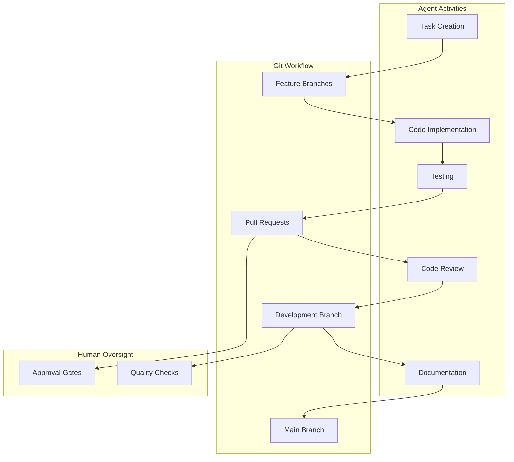
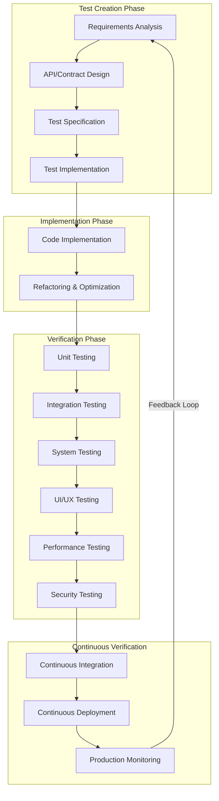
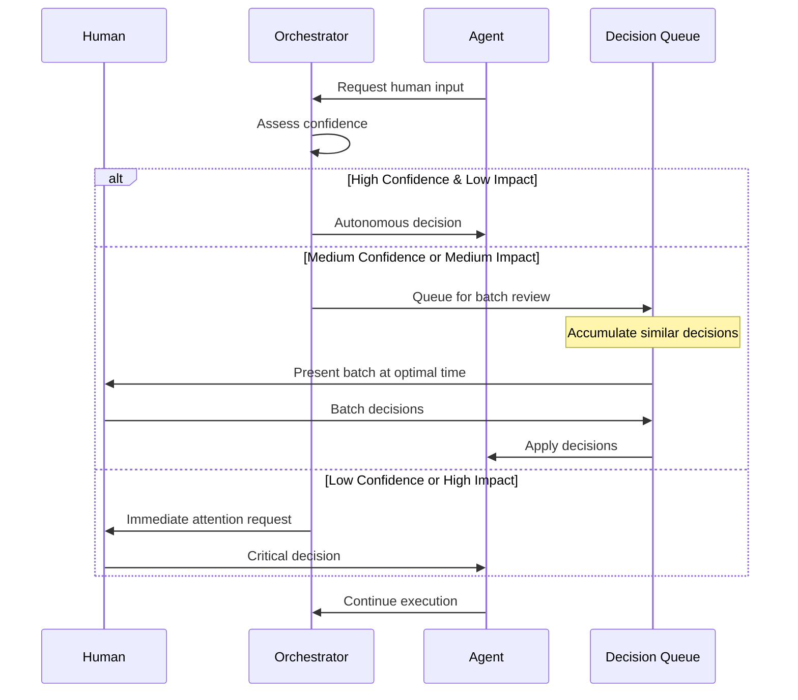

# Ōtobotto: An Autonomous AI Swarm Architecture for Enterprise Software Development

## Abstract

This paper presents Ōtobotto, a novel autonomous AI swarm architecture designed for enterprise-grade software development. By integrating modern software project management principles with distributed AI agent coordination, Ōtobotto creates a robust system capable of handling complex software projects across diverse technology stacks. The architecture incorporates Git-native workflows, comprehensive test-driven development practices, and adaptive human-in-the-loop strategies to maintain quality while maximizing productivity. This paper outlines the core components, technical implementation considerations, and potential applications of the Ōtobotto system, providing a framework for future development of autonomous software engineering systems.

## 1. Introduction

As software systems grow increasingly complex, traditional development methodologies face significant challenges in maintaining quality, timeline adherence, and budgetary constraints. Concurrently, Large Language Models (LLMs) have demonstrated remarkable capabilities in code generation, problem-solving, and technical reasoning. Ōtobotto leverages these capabilities through a coordinated swarm of specialized AI agents operating within a structured framework designed to mirror established software development best practices.

Unlike single-agent approaches, Ōtobotto employs a multi-agent architecture where specialized components work in concert, enabling parallel development, cross-verification, and continuous integration throughout the development lifecycle. By combining the strengths of AI with proven software engineering methodologies, Ōtobotto aims to create an autonomous system capable of delivering enterprise-grade software while maintaining appropriate human oversight.

### 1.1 Differentiation from Existing Solutions

Ōtobotto distinguishes itself from current AI coding assistants and multi-agent systems through:

**Architectural Distinctions**
- True swarm coordination rather than sequential agent handoffs
- Git-native workflows embedded in core architecture
- Test-driven development as a fundamental principle
- Enterprise integration capabilities by design

**Technical Advantages**
- Sophisticated memory hierarchy beyond simple vector storage
- Adaptive token optimization for cost management
- Cross-language expertise with technology-agnostic patterns
- Comprehensive security and compliance frameworks

**Operational Benefits**
- Balanced human integration with minimal interruption
- Explainable decision-making throughout the process
- Measurable productivity and quality improvements
- Progressive autonomy model building trust over time

### 1.2 Enterprise Focus

Ōtobotto is specifically designed for complex enterprise software environments:

- Support for diverse legacy and modern technology stacks
- Integration with enterprise systems and platforms
- Compliance with industry-specific regulations
- Scalability for large, distributed development teams
- Support for sophisticated project management methodologies

## 2. Background and Motivation

### 2.1 Challenges in Complex Software Development

Enterprise software development faces numerous challenges:

- Increasing system complexity requiring diverse expertise
- Knowledge fragmentation across team members
- Difficulty maintaining project coherence at scale
- Balancing innovation with standardization and consistency
- Managing technical debt over long project lifecycles

### 2.2 Limitations of Current AI Approaches

While LLMs have shown promise in code generation, several limitations persist:

- Context window constraints limiting system understanding
- Lack of persistent memory across sessions
- Limited ability to coordinate multiple aspects of complex projects
- Inconsistent testing and validation practices
- Challenges in maintaining architectural integrity

### 2.3 The Case for AI Swarms

Ōtobotto addresses these limitations through a swarm-based approach that:

- Distributes responsibilities across specialized agents
- Maintains shared context through structured memory systems
- Implements comprehensive verification at multiple levels
- Follows established software development practices
- Provides appropriate human touchpoints for guidance and oversight

## 3. Evolving AI Capabilities and Global Competition

### 3.1 International AI Race and Model Advancement

The development of foundation models is accelerating through intensifying global competition, particularly between the United States, China, and Europe. This competition is driving rapid advancements that directly enable Ōtobotto's vision:

**North American Advancements**:
- OpenAI's progression from GPT-4 to more sophisticated successors
- Anthropic's Claude models with enhanced reasoning and task planning capabilities
- Google's Gemini models reaching 2M+ token context windows
- Meta's open-source LLaMA and Llama family, democratizing access to powerful models

**Chinese Innovation**:
- DeepSeek R1's breakthrough capabilities in reasoning and code generation
- Monica's Manus system demonstrating general AI agency across diverse tasks
- Baidu's ERNIE models advancing multilingual and multimodal capabilities
- Moonshot AI's rapid progress in agent architectures

**European Contributions**:
- Mistral AI's efficient model architecture
- Aleph Alpha's focus on sovereign AI with strong governance
- Various open-source initiatives enhancing transparency and accessibility
- Regulatory frameworks shaping responsible AI development

This global race is creating a rapidly evolving foundation for systems like Ōtobotto, with each advancement making autonomous development increasingly feasible.

### 3.2 Critical Technological Breakthroughs

Several key technological advancements are enabling Ōtobotto's approach:

**Expanded Context Windows**:
- Evolution from 8K tokens to 32K, 128K, and now 2M+ token contexts
- Elimination of traditional context limitations that hampered long-term reasoning
- Ability to hold entire codebases in context during development
- Enhanced capability to understand project history and dependencies

**Advanced Reasoning Capabilities**:
- Chain-of-Thought and Tree-of-Thought reasoning techniques
- Self-critique and recursive improvement methodologies
- Multimodal reasoning across code, diagrams, and natural language
- Higher-order planning and task decomposition

**Agent Autonomy Improvements**:
- Tool use sophistication and self-correction
- Memory management and recall enhancements
- Planning horizon extension and goal persistence
- Meta-cognitive capabilities for self-regulation

**Training Methodologies**:
- RLHF (Reinforcement Learning from Human Feedback) refinements
- RLAIF (Reinforcement Learning from AI Feedback) scaling mechanisms
- Constitutional AI approaches for alignment with human values
- Domain-specific fine-tuning techniques

### 3.3 Implications for Ōtobotto

These advancements create unprecedented opportunities for the Ōtobotto system:

**Enhanced Capabilities**:
- Project decomposition from initial brief to comprehensive roadmap
- Coordinated specialist work across diverse technology domains
- Sustained focus on long-running projects with consistent quality
- Proactive initiative taking with appropriate human oversight

**Accelerating Feasibility**:
- Capabilities that seemed years away are becoming possible within months
- System components can leverage increasingly powerful foundation models
- Implementation complexity is reduced as models handle more sophisticated reasoning
- Economic viability improves with greater model efficiency and capability

**Future Trajectory**:
- The pace of improvement shows no signs of slowing
- International competition ensures continued investment and innovation
- Open-source efforts democratize access to powerful capabilities
- Integration of specialized and general capabilities creates new possibilities

The rapid evolution of underlying AI capabilities makes Ōtobotto not only increasingly feasible but positions it at the forefront of a transformation in how complex software is conceived, developed, and maintained. What follows is an architecture designed to leverage these advancements while remaining adaptable to the continued evolution of foundation models.

## 4. Architecture Overview

Ōtobotto's architecture is designed to mirror proven software project management techniques while adapting them to an AI-native context. The system follows a hierarchical decomposition approach that maintains coherence from high-level objectives to individual implementation tasks.

```mermaid
flowchart TD
    subgraph "Strategic Layer"
        Vision["Project Vision/Mission"]
        Objectives["Strategic Objectives"]
        Epics["Epics/Features"]
    end
    
    subgraph "Tactical Layer"
        Stories["User Stories/Requirements"]
        Milestones["Milestones"]
    end
    
    subgraph "Implementation Layer"
        Tasks["Tasks"]
        Subtasks["Subtasks"]
        Tests["Test Cases"]
    end
    
    subgraph "Execution Environment"
        Agents["Agent Network"]
        Memory["Memory Systems"]
        Knowledge["Knowledge Base"]
        VersionControl["Git Integration"]
    end
    
    Vision --> Objectives
    Objectives --> Epics
    Epics --> Stories
    Stories --> Tasks
    Tasks --> Subtasks
    Stories --> Tests
    
    Agents <--> Memory
    Agents <--> Knowledge
    Agents <--> VersionControl
    
    Tasks <--> Agents
    Tests <--> Agents
    
    subgraph "Human Integration"
        HITL["Human-in-the-Loop"]
    end
    
    HITL <--> Agents
    HITL <--> Strategic Layer
    HITL <--> Milestones
```

### 3.1 Strategic Fundamentals

- **Vision and Mission Alignment**: Clear articulation of project goals driving all development decisions
- **Architectural Integrity**: Established principles ensuring technical coherence
- **Risk Management**: Proactive identification and mitigation strategies
- **Quality Assurance**: Embedded verification throughout the development lifecycle

### 3.2 Project Decomposition Hierarchy

1. **Project Vision/Mission**: Overarching purpose driving all decisions
2. **Strategic Objectives**: High-level goals aligned with business value
3. **Epics/Features**: Major functionality groups with measurable outcomes
4. **User Stories/Requirements**: User-centered functionality descriptions
5. **Milestones**: Key achievement points with clear evaluation criteria
6. **Tasks**: Implementation-ready work items with clear acceptance criteria
7. **Subtasks**: Granular work units that can be individually assigned and verified

### 3.3 AI-Native Adaptations

Ōtobotto adapts traditional methodologies to an AI-native context:

- **Computation-Based Units**: Replace human-oriented timeframes with metrics based on processing cycles, token consumption, and task completion
- **Git-Native Operations**: Direct integration with version control principles including branching strategies, pull requests, and code review
- **Test-Driven Development**: Specialized agents focused on test creation before implementation
- **Cost Optimization**: Dynamic resource allocation based on task complexity and budget constraints

### 3.4 Dashboard-First, KPI-Driven Development

Ōtobotto implements a dashboard-first approach to project management:

- **Real-time Metrics Visualization**: Centralized dashboards display key performance indicators from the beginning
- **Goal Alignment**: All development activities are linked to measurable objectives
- **Decision Support**: Data-driven insights guide both AI and human decision-making
- **Continuous Feedback Loop**: Automated collection and analysis of performance data

**Dashboard Integration Platforms** (including but not limited to):
- **Grafana**: Real-time monitoring and alerting for system performance
- **Looker Studio**: Business intelligence for strategic decision-making
- **Tableau**: Advanced data visualization for complex analytics
- **Power BI**: Enterprise reporting and trend analysis
- **Custom Dashboards**: Project-specific visualizations for specialized metrics

**Core KPI Categories**:
- **Development Velocity**: Story points completed, code output, iteration cycles
- **Quality Metrics**: Test coverage, defect density, technical debt accumulation
- **Business Value**: Feature adoption, user engagement, revenue impact
- **Resource Utilization**: Token consumption, compute efficiency, cost per feature
- **User Satisfaction**: NPS (Net Promoter Score), CSAT, user feedback analysis
- **ESG Metrics**:
  - **Environmental**: Energy efficiency, carbon footprint, resource optimization
  - **Social**: Accessibility compliance, diversity of datasets, inclusive design practices
  - **Governance**: Ethical AI principles adherence, transparency measures, bias mitigation

### 3.5 Planning-First Methodology

Ōtobotto prioritizes thorough planning before implementation:

- **Architecture Design Phase**: Comprehensive system design before code implementation
- **Documentation Generation**: Automatic creation of architectural documents
- **Goal Definition Framework**: Structured approach to defining measurable objectives
- **Feedback Collection Infrastructure**: Systems for gathering and processing user feedback
- **Continuous Improvement Loop**: Built-in mechanisms for measuring and enhancing performance

## 4. Core Components

### 4.1 Orchestration Layer

The central coordination system manages task allocation, dependency resolution, and agent communication. Key functions include:

- Priority-based work distribution
- Task dependency management
- Resource optimization
- Progress monitoring and reporting
- Conflict resolution when agents propose competing solutions

### 4.2 Agent Network

Specialized AI agents with defined roles form the core workforce. This agent architecture is flexible and can be extended with additional specialized agents as needed:

- **Architect Agents**: System design and technical decision-making
- **Development Agents**: Implementation across various technology stacks
- **Testing Agents**: Test design, execution, and validation
- **Documentation Agents**: Code documentation and knowledge management
- **DevOps Agents**: Build, deployment, and infrastructure management
- **Project Manager Agents**: Task coordination, timeline management, and resource allocation
- **QA Agents**: Quality assurance beyond testing, including usability assessment
- **UI/UX Agents**: Interface design and user experience optimization
- **Analytics Agents**: Data analysis and metrics reporting
- **ESG Compliance Agents**: Environmental impact assessment, accessibility verification, ethical considerations
- **Security Agents**: Vulnerability assessment, compliance verification, threat modeling
- **Governance Agents**: Regulatory compliance, audit documentation, policy enforcement
- **Specialty Agents**: Domain-specific experts (e.g., industry verticals, performance optimization)

```mermaid
flowchart TD
    Orchestrator["Orchestration Layer"]
    
    subgraph "Core Development Agents"
        Architect["Architect Agents"]
        Dev["Development Agents"]
        Test["Testing Agents"]
        Doc["Documentation Agents"]
    end
    
    subgraph "Support Agents"
        DevOps["DevOps Agents"]
        PM["Project Manager Agents"]
        QA["QA Agents"]
        UIUX["UI/UX Agents"]
        Analytics["Analytics Agents"]
    end
    
    subgraph "Specialty Agents"
        Security["Security Experts"]
        Performance["Performance Experts"]
        Domain["Domain Specialists"]
        Data["Data Engineers"]
    end
    
    Orchestrator <--> Core Development Agents
    Orchestrator <--> Support Agents
    Orchestrator <--> Specialty Agents
    
    Core Development Agents <--> Support Agents
    Core Development Agents <--> Specialty Agents
```

### 4.3 Knowledge Infrastructure

#### 4.3.1 Retrieval-Augmented Generation (RAG) System

A robust knowledge acquisition and processing system that includes:

- Documentation crawlers specialized by source type
- Enterprise knowledge connectors for private repositories
- Domain-specific research agents
- Structured knowledge representation for effective retrieval

```mermaid
flowchart TD
    subgraph "Knowledge Acquisition"
        WebCrawlers["Web Crawlers"]
        DocParsers["Document Parsers"]
        APIConnectors["API Connectors"]
        PrivateRepos["Private Repository Access"]
    end
    
    subgraph "Knowledge Processing"
        Chunking["Content Chunking"]
        Embedding["Embedding Generation"]
        Indexing["Vector Indexing"]
        Metadata["Metadata Extraction"]
    end
    
    subgraph "Knowledge Storage"
        VectorDB["Vector Databases"]
        MetadataDB["Metadata Store"]
        BlobStorage["Document Storage"]
    end
    
    subgraph "Knowledge Retrieval"
        QueryProcessor["Query Processing"]
        RelevanceRanking["Relevance Ranking"]
        ContextAssembly["Context Assembly"]
    end
    
    Knowledge Acquisition --> Knowledge Processing
    Knowledge Processing --> Knowledge Storage
    Knowledge Storage --> Knowledge Retrieval
    Knowledge Retrieval --> Agents["Agent Network"]
    
    Users["Human Users"] --> Knowledge Acquisition
    Users --> Knowledge Retrieval
```

#### 4.3.2 Hierarchical Memory System

A three-tiered memory architecture:

- **Operational Memory** (short-term): Real-time agent communication and context
- **Project Memory** (mid-term): Project-specific knowledge and decisions
- **Strategic Memory** (long-term): Patterns, best practices, and cross-project learnings

```mermaid
flowchart TD
    subgraph "Operational Memory"
        MessageQueue["Message Queue"]
        ActiveContext["Active Context Windows"]
        WorkingState["Working State"]
        ShortTermCache["Short-term Cache"]
    end
    
    subgraph "Project Memory"
        GitRepo["Git Repository"]
        VectorDB["Vector Database"]
        DecisionLog["Decision Records"]
        PreferenceStore["Preference Store"]
    end
    
    subgraph "Strategic Memory"
        PatternLibrary["Pattern Library"]
        BestPractices["Best Practices"]
        DomainKnowledge["Domain Knowledge"]
        CrossProjectLearnings["Cross-Project Learnings"]
    end
    
    Agent1["Agent 1"] <--> Operational Memory
    Agent2["Agent 2"] <--> Operational Memory
    Agent3["Agent 3"] <--> Operational Memory
    
    Operational Memory <--> Project Memory
    Project Memory <--> Strategic Memory
    
    Human["Human-in-the-Loop"] <--> Project Memory
    Human <--> Strategic Memory
```

#### 4.3.3 Regulatory Knowledge Base

A specialized knowledge repository for industry regulations:

- **Industry-Specific Regulations**: Banking, healthcare, transportation, etc.
- **Regional Compliance Requirements**: GDPR, HIPAA, SOC2, ISO standards
- **Regulatory Updates Tracking**: Automated monitoring of changing regulations
- **Compliance Verification**: Automated checks against regulatory requirements
- **Documentation Generation**: Compliance documentation for auditing purposes

### 4.4 Git Integration Layer

Direct integration with version control systems:

- Automated branch management for parallel development
- Pull request lifecycle automation
- Code review and approval workflows
- Issue/ticket integration for work tracking



### 4.5 Testing and Verification Framework

Comprehensive test-driven development approach:

- Contract design and test specification before implementation
- Multi-level testing (unit, integration, system)
- Specialized frontend/UI testing solutions
- Performance and security verification



### 4.6 Support and Maintenance System

Infrastructure for long-term project support:

- **Ticketing System Integration**: Automated issue tracking and prioritization
- **User Support Workflow**: Structured approach to handling user requests
- **Continuous Monitoring**: Real-time system performance tracking
- **Automated Updates**: Scheduled maintenance and feature deployments
- **Knowledge Base Management**: User-facing documentation and help resources
- **Historical Analysis**: Trend recognition for proactive problem resolution

## 5. Technical Implementation

```mermaid
flowchart TD
    subgraph "Infrastructure Layer"
        Containers["Containerization"]
        Messaging["Messaging Systems"]
        VectorDatabases["Vector Databases"]
        ExecutionEnv["Execution Environments"]
    end
    
    subgraph "Orchestration Layer"
        TaskAllocation["Task Allocation"]
        DependencyMgmt["Dependency Management"]
        ResourceOpt["Resource Optimization"]
        AgentCoord["Agent Coordination"]
    end
    
    subgraph "Agent Layer"
        DevAgents["Development Agents"]
        TestAgents["Testing Agents"]
        SpecialtyAgents["Specialty Agents"]
        SupportAgents["Support Agents"]
    end
    
    subgraph "Integration Layer"
        GitIntegration["Git Integration"]
        APIConnectors["API Connectors"]
        DevTools["Development Tools"]
        DeploymentTools["Deployment Tools"]
    end
    
    Infrastructure Layer --> Orchestration Layer
    Orchestration Layer --> Agent Layer
    Agent Layer --> Integration Layer
    Integration Layer --> External["External Systems"]
```

### 5.1 Containerization and Execution Environments

Ōtobotto requires secure, scalable environments for agent operation. The system should explore and evaluate (but not be limited to) the following technologies:

- **Kubernetes Orchestration**: Container management for agent deployment and scaling
- **E2B Environments**: Ephemeral, secure environments with fast spin-up times for isolated task execution
- **WebAssembly Sandboxing**: Lightweight containerization for code execution and testing
- **Secure Execution Boundaries**: Isolation to prevent unintended system interactions
- **Dynamic Resource Allocation**: Scaling based on computational requirements
- **Energy-Efficient Orchestration**: Scheduling optimizations to minimize resource usage and carbon footprint

### 5.2 Inter-Agent Communication

Robust messaging infrastructure enables agent coordination. The following technologies represent potential options to investigate (not an exhaustive list):

- **Kafka/RabbitMQ**: High-throughput distributed message queues for reliable delivery
- **Inngest**: Event-driven workflow engine for coordinating complex multi-step processes
- **Upstash**: Serverless data solutions for Redis and Kafka to simplify operations
- **NATS**: Lightweight, high-performance messaging system
- **State Synchronization**: Mechanisms to maintain shared understanding
- **Prioritization Protocols**: Message handling based on task importance and dependencies

### 5.3 Vector Databases for Long-Term Memory

Semantic storage solutions for code understanding and knowledge retrieval. The implementation should evaluate these and other emerging options based on performance, sustainability, and project requirements:

- **Pinecone**: Managed vector database with high availability and scalability
- **Weaviate**: Open-source vector search engine with multi-modal capabilities
- **FAISS**: Facebook AI Similarity Search for efficient similarity search
- **Milvus**: Open-source vector database with advanced filtering
- **Chroma**: Purpose-built for AI applications with embedding storage
- **Qdrant**: Vector database optimized for extended filtering
- **LanceDB**: Lightweight vector database with columnar storage
- **Pgvector**: PostgreSQL extension for vector similarity search

#### Embedding Generation Options (among others to consider):
- **OpenAI Embeddings**: High-quality commercial embedding generation
- **Cohere Embeddings**: Alternative commercial provider with multilingual capabilities
- **Sentence Transformers**: Open-source embedding models (e.g., MPNet, BERT)
- **BGE Embeddings**: Optimized for specialized retrieval tasks
- **Local Embedding Models**: Self-hosted options for sensitive data scenarios
- **E5 Embeddings**: Microsoft's efficient embedding models

### 5.4 Information Retrieval Systems

Comprehensive systems for gathering and processing external knowledge:

- **Web Crawling Infrastructure**:
  - **Crawl4AI**: Specialized crawler for AI-focused information gathering
  - **Playwright/Puppeteer**: Automated browser interactions for complex content
  - **Apify/ScrapingBee**: Managed scraping services with anti-detection features
  - **Langchain Document Loaders**: Specialized parsers for various document formats

- **Data Processing Pipeline**:
  - Document chunking and processing
  - Metadata extraction and tagging
  - Content classification and relevance scoring
  - Duplicate detection and version management

### 5.5 Multi-Agent Orchestration Frameworks

The following represents a non-exhaustive list of potential foundation frameworks that could be evaluated for the Ōtobotto architecture. The final implementation may incorporate elements from multiple frameworks or develop custom solutions where needed:

- **AgentKit by Inngest**: Framework for building reliable and observable AI agents
- **Mastra.ai**: Coordination framework for multi-agent systems
- **Atomic Agents**: Modular approach to agent composition
- **LangChain/LangGraph**: Tools for building agent workflows and coordination
- **AutoGen**: Microsoft's framework for multi-agent conversation
- **CrewAI**: Framework focused on role-based agent collaboration
- **Haystack Agents**: Tool-augmented agents with flexible routing
- **LlamaIndex**: Framework for context augmentation and retrieval
- **OpenAgents**: Open-source customizable agent platform
- **Custom Implementation**: Purpose-built orchestration layer designed specifically for software development workflows

### 5.6 Token Economy and Cost Management

The Ōtobotto system implements sophisticated token optimization:

- **Token Usage Tracking**: Granular monitoring of token consumption by agent and task
- **Budget Controls**: Configurable limits at project, feature, and task levels
- **Model Selection Optimization**:
  - Dynamic routing between models based on task complexity and budget
  - Batch processing for efficiency
  - Caching of common responses
- **Token Efficiency Techniques**:
  - Prompt compression
  - Context pruning
  - Knowledge distillation
  - Response summarization
- **Cost Projection**:
  - Historical usage analysis
  - Predictive modeling of completion costs
  - Budget allocation recommendations

### 5.7 Security and Compliance Framework

Enterprise-grade security implementation:

- **Execution Isolation**: Sandboxed environments for untrusted code execution
- **Data Access Controls**: Role-based access to sensitive project information
- **Authentication and Authorization**: Multi-factor authentication and fine-grained permissions
- **Audit Logging**: Comprehensive tracking of all system activities
- **Compliance Support**:
  - SOC 2 compliance capabilities
  - GDPR/CCPA data handling
  - Industry-specific regulatory frameworks (HIPAA, FINRA, etc.)
- **Secret Management**: Secure handling of credentials and tokens
- **Vulnerability Management**: Regular security scanning and updates

### 5.8 Deployment Flexibility

Ōtobotto offers multiple deployment options to meet diverse requirements:

- **Jurisdiction-Based Deployment**: Data localization options for regulatory compliance
  - Regional cloud instances (EU, US, China, etc.)
  - Data sovereignty guarantees
  - Compliance with local data protection laws

- **On-Premises Deployment**: Self-hosted option for sensitive environments
  - Enterprise data center integration
  - Air-gapped environments for high security
  - "Bring Your Own Cloud" capabilities

- **Hybrid Deployment**: Combination of cloud and on-premises components
  - Sensitive operations on private infrastructure
  - Non-sensitive tasks on cloud infrastructure
  - Secure communication between environments

- **Update Management**:
  - Pull-based updates for air-gapped environments
  - Automated update verification and validation
  - Version pinning for stable environments

- **Telemetry Controls**:
  - Granular control over usage data collection
  - Anonymous usage statistics options
  - Complete telemetry disablement for sensitive deployments

## 6. Human Integration Framework

### 6.1 Adaptive Human-in-the-Loop Strategy

Ōtobotto implements a balanced approach to human oversight:

- **Interaction Scheduling**: Awareness of human availability across time zones and work schedules
- **Decision Queuing**: Non-blocking accumulation of items requiring human input
- **Confidence Scoring**: Automated assessment of when human review is necessary
- **Bundle Optimization**: Grouping related decisions to minimize interruptions
- **Interaction Types**: Various forms of human engagement (approvals, guidance, feedback, creativity)
- **Urgency Classification**: Prioritization system for human attention requirements



### 6.2 Progressive Autonomy Model

The system gradually builds trust through:

- Initial high-oversight phases with frequent checkpoints
- Metrics-based autonomy expansion as reliability is demonstrated
- Clear indicators of decision confidence
- Explainability features for significant decisions

### 6.3 Continuity Management

Maximizing productivity while respecting human constraints:

- Weekend/overnight planning for non-blocking work
- Critical path analysis to prioritize work that won't create dependencies
- Parallel track development to route around human decision points
- Predictive scheduling based on typical response patterns

## 7. Expanded Capabilities

### 7.1 Digital Marketing Integration

Beyond code development, Ōtobotto can manage:

- Campaign design with platform-specific optimization
- Content generation across marketing channels
- Analytics integration and performance monitoring
- A/B testing and optimization workflows
- Social media asset creation and publishing
- SEO content optimization and recommendation
- Email marketing campaign management
- PPC (Pay-Per-Click) campaign optimization

### 7.2 Design System Management

Visual and UX capabilities include:

- UI component generation with accessibility compliance
- Visual asset creation through AI image generation
- Brand consistency enforcement
- Prototyping and user testing coordination
- Design system documentation and versioning
- Cross-platform design translation
- Animation and interaction design
- Localization and internationalization management

### 7.3 Operations and Monitoring

Production systems management capabilities:

- Deployment automation
- Performance monitoring and alerting
- Security compliance verification
- User behavior analytics
- Infrastructure scaling recommendations
- Incident response and remediation
- Cost optimization analysis
- SLA compliance tracking and reporting

### 7.4 Data Analytics and Business Intelligence

Advanced data processing capabilities:

- ETL (Extract, Transform, Load) pipeline management
- Data warehouse schema design and optimization
- Business intelligence dashboard creation
- Anomaly detection and trend analysis
- Predictive analytics model development
- Natural language querying of business data
- Automated reporting and insights generation
- Data governance and compliance monitoring

## 8. Polyglot Implementation

### 8.1 Technology-Agnostic Architecture

Ōtobotto is designed to work across diverse technology stacks:

- Enterprise platforms (JVM, .NET, iOS/Android)
- Web technologies (JavaScript/TypeScript ecosystems)
- Data science environments (Python, R)
- Legacy systems (COBOL, Pascal, Fortran)

### 8.2 Specialized Language Agents

- Language-specific coding experts
- Framework specialists for major ecosystems
- Migration experts for legacy code modernization
- Database specialists across SQL and NoSQL technologies

### 8.3 Cross-Language Integration

- **Interface Definition Standards**: Language-agnostic API specifications
- **Interoperability Patterns**: Best practices for cross-language communication
- **Translation Capabilities**: Automated conversion between equivalent patterns
- **Technology Selection Guidance**: Objective recommendation based on requirements

### 8.4 Enterprise Integration

- **ERP Systems**: SAP, Oracle, Microsoft Dynamics integration
- **CRM Systems**: Salesforce, HubSpot, Microsoft Dynamics integration
- **Data Warehouse**: Snowflake, Redshift, BigQuery integration
- **Business Intelligence**: Tableau, Power BI, Looker integration
- **Legacy Middleware**: Integration with enterprise service buses and message queues

## 9. Project Design Principles

### 9.1 Modularity and Extensibility

Ōtobotto prioritizes future-proof design:

- **Microservices Architecture**: Decomposition into independently maintainable services
- **API-First Design**: Well-documented interfaces between components
- **Standardized Patterns**: Consistent design patterns across the codebase
- **Feature Flagging**: Controlled feature rollout and experimentation
- **Progressive Enhancement**: Core functionality with optional advanced features

### 9.2 Sustainability by Design

Ōtobotto incorporates environmental and social responsibility into its core design:

- **Energy Efficiency**: Optimized algorithms and resource utilization
- **Carbon-Aware Computing**: Scheduling compute-intensive tasks during low-carbon intensity periods
- **Resource Optimization**: Minimizing unnecessary computations and storage
- **Sustainable Infrastructure Selection**: Preference for energy-efficient hosting options
- **Circular Design Principles**: Planning for long-term maintenance and responsible end-of-life
- **Green Software Patterns**: Implementation of Green Software Foundation recommended practices
- **ESG Framework Alignment**: Compatibility with major sustainability frameworks:
  - UN Sustainable Development Goals (SDGs)
  - Task Force on Climate-related Financial Disclosures (TCFD)
  - Sustainability Accounting Standards Board (SASB) metrics
  - Global Reporting Initiative (GRI) standards

### 9.3 Human-Reviewable Design

All outputs are optimized for human understanding:

- **Clean Code Principles**: Self-documenting code with meaningful naming
- **Comprehensive Documentation**: Automated generation of technical documentation
- **Decision Records**: Captured rationale for architectural choices
- **Review-Optimized PRs**: Manageable pull request sizes with clear descriptions
- **Visual Architecture**: Diagram generation for system understanding

### 9.4 Vendor Independence

Preventing lock-in to the Ōtobotto system:

- **Standard Tooling**: Reliance on industry-standard development tools
- **Open Formats**: Data stored in open, portable formats
- **Exportable Knowledge**: Comprehensive documentation enabling transitions
- **Handover Protocols**: Clear processes for transferring projects to human teams
- **Code Quality Standards**: Adherence to universal best practices regardless of tooling

## 10. Industry-Specific Regulatory Compliance

This section outlines key regulatory frameworks that Ōtobotto should consider during project development. This list is not exhaustive and should be continuously updated as regulations evolve:

### 10.1 Financial Services

- **Banking Regulations**:
  - Basel III/IV capital requirements
  - Anti-Money Laundering (AML) compliance
  - Know Your Customer (KYC) requirements
  - PCI DSS for payment processing
  - SOX compliance for public companies

- **Fintech Considerations**:
  - Open Banking standards (PSD2 in EU)
  - Payment processor regulations
  - Cryptocurrency compliance frameworks
  - GDPR/CCPA for customer data

### 10.2 Healthcare

- **Patient Data Protection**:
  - HIPAA compliance (US)
  - NHS Digital standards (UK)
  - PIPEDA (Canada)
  - Patient consent management

- **Medical Device Software**:
  - FDA regulations (US)
  - EU MDR (Medical Device Regulation)
  - IEC 62304 medical device software standards
  - DICOM standards for medical imaging

### 10.3 Transportation and Logistics

- **Automotive Software**:
  - ISO 26262 functional safety
  - ASPICE process improvement
  - AUTOSAR architecture standards
  - Autonomous vehicle regulations

- **Aviation Systems**:
  - DO-178C for safety-critical software
  - EASA/FAA certification requirements
  - ARINC standards for avionics
  - Maintenance tracking requirements

### 10.4 Energy and Utilities

- **Grid Management Systems**:
  - NERC CIP cybersecurity standards
  - Smart grid interoperability standards
  - SCADA security requirements
  - ISO 50001 energy management

### 10.5 Cross-Industry Regulations

- **Data Protection**:
  - GDPR (European Union)
  - CCPA/CPRA (California)
  - LGPD (Brazil)
  - PIPL (China)
  - APPI (Japan)
  - PDPA (Singapore, Thailand)
  - And other emerging data protection regulations globally

- **Security Standards**:
  - SOC 2 compliance
  - ISO 27001 information security
  - NIST Cybersecurity Framework
  - FedRAMP for government systems
  - PCI DSS for payment card data
  - NIS2 Directive (EU)

- **Accessibility Requirements**:
  - WCAG 2.1/2.2 standards
  - ADA compliance (US)
  - EN 301 549 (EU)
  - Section 508 (US Government)
  - Accessibility for Ontarians with Disabilities Act (AODA)

### 10.6 ESG and Sustainability Regulations

- **Environmental Reporting**:
  - EU Corporate Sustainability Reporting Directive (CSRD)
  - SEC Climate-Related Disclosures (proposed US)
  - UK Companies Act requirements
  - Australian National Greenhouse and Energy Reporting (NGER)

- **Sustainable Finance**:
  - EU Taxonomy Regulation
  - Sustainable Finance Disclosure Regulation (SFDR)
  - Green Bond Standards
  - Climate-Related Financial Disclosure requirements

- **Digital Ethics**:
  - EU AI Act
  - IEEE Ethically Aligned Design standards
  - Various national AI ethics frameworks
  - Industry-specific ethical guidelines

## 11. Implementation Roadmap

### 11.1 Phased Development Approach

The implementation of Ōtobotto should follow a phased approach:

**Phase 1: Foundation (3-6 months)**
- Core orchestration system
- Basic agent specialization
- Git integration
- Essential testing framework
- Initial human-in-the-loop interfaces

**Phase 2: Knowledge Enhancement (3-4 months)**
- RAG implementation
- Memory hierarchy
- Documentation crawling
- Knowledge processing pipelines

**Phase 3: Advanced Capabilities (4-6 months)**
- Expanded agent specialization
- Enhanced testing frameworks
- UI/UX development
- Enterprise integration

**Phase 4: Optimization (Ongoing)**
- Performance tuning
- Cost optimization
- Security hardening
- Compliance frameworks

### 11.2 Deployment Strategy

Different deployment models for different customer needs:

- **SaaS Model**: Cloud-hosted implementation with subscription pricing
- **On-Premises**: Secure local deployment for sensitive enterprise environments
- **Hybrid Model**: Core functionality on-premises with cloud capabilities

## 12. Risk Assessment and Mitigation

### 12.1 Technical Risks

| Risk | Impact | Mitigation Strategy |
|------|--------|---------------------|
| Agent coordination failures | System incoherence | Robust message queue with conflict resolution |
| Knowledge retrieval inaccuracies | Poor decision quality | Verification mechanisms and human oversight |
| Token consumption overruns | Cost overages | Budget controls and optimization algorithms |
| Context window limitations | Fragmented understanding | Improved memory management and chunking strategies |
| Security vulnerabilities | Data breaches | Sandboxed execution and security auditing |

### 12.2 Business Risks

| Risk | Impact | Mitigation Strategy |
|------|--------|---------------------|
| Market adoption resistance | Revenue shortfall | Phased introduction with proven ROI metrics |
| Legal and compliance issues | Regulatory penalties | Compliance-focused development and documentation |
| Competitive pressure | Market share erosion | Continuous innovation and partnership strategy |
| Talent acquisition | Development delays | Strategic hiring and open-source contributor program |
| Operating costs | Profit margin pressure | Infrastructure optimization and scaling efficiency |

## 13. Business Case and Monetization

### 13.1 Market Opportunity

The Ōtobotto system addresses significant market needs:

- **Enterprise Software Development**: $450B global market with chronic talent shortages
- **Developer Productivity Tools**: $10B market growing at 15% annually
- **AI Development Platforms**: Emerging category with exponential growth potential
- **Digital Transformation Services**: $380B market seeking automation solutions

### 13.2 Monetization Models

Multiple revenue streams align with different customer segments:

**Enterprise Model**
- Annual licensing based on development team size
- Support and service agreements
- Custom integration professional services
- Industry-specific solutions at premium pricing

**SMB/Startup Model**
- Usage-based pricing aligned with development velocity
- Freemium model with core features free and advanced capabilities paid
- Pay-per-project options for intermittent users

**Education/Research Model**
- Discounted licenses for academic institutions
- Research partnership programs
- Grant-funded pilot programs

### 13.3 Open Source vs. Proprietary Considerations

**Hybrid Open Core Strategy**
- Core orchestration framework as open source
- Advanced enterprise features as proprietary
- Commercial licensing for production use

**Benefits**:
- Community-driven innovation
- Wider adoption and ecosystem development
- Talent acquisition through community leadership
- Market education and standards setting

**Proprietary Elements**:
- Enterprise security features
- Advanced scaling capabilities
- Integration with commercial services
- Specialized industry solutions

### 13.4 Strategic Partnerships

Key partnership opportunities with technology providers:

**Cloud Platforms**
- AWS/Azure/GCP for infrastructure integration
- Special pricing and co-marketing opportunities
- Technical certification and validated architectures

**AI Model Providers**
- Anthropic, OpenAI, Google for optimized model access
- Volume-based discounting arrangements
- Early access to capabilities and fine-tuning options

**Development Ecosystem**
- GitHub/GitLab/Bitbucket for seamless integration
- IDEs and development tools for workflow enhancement
- CI/CD platform partnerships for deployment optimization

**Industry Verticals**
- Financial services compliance partners
- Healthcare systems integration
- Manufacturing process optimization

### 13.5 Value Proposition and ROI

Key value metrics for customers:

- **Development Velocity**: 3-5x increase in feature delivery speed
- **Quality Improvement**: 40-60% reduction in defects and technical debt
- **Cost Efficiency**: 30-50% reduction in development costs
- **Team Satisfaction**: Elimination of repetitive tasks allowing focus on creative work
- **Time-to-Market**: Critical competitive advantage in fast-moving industries

### 13.6 ESG and Sustainable Investment Alignment

Ōtobotto is designed to align with sustainable investing principles:

- **Environmental Impact Reduction**:
  - Lower carbon footprint through optimized compute utilization
  - Energy-efficient coding practices and infrastructure recommendations
  - Resource consumption monitoring and optimization

- **Social Responsibility**:
  - Accessibility-first development approach
  - Inclusive design practices built into core workflows
  - Bias detection and mitigation in AI-generated code and content
  - Support for diverse development teams and work patterns

- **Governance Excellence**:
  - Transparent decision-making and documentation
  - Ethical AI principles embedded in workflows
  - Comprehensive audit trails and compliance documentation
  - Responsible data handling practices

- **Sustainable Investment Qualifications**:
  - Alignment with ESG fund requirements
  - Support for sustainability reporting frameworks
  - Measurable impact metrics for ESG reporting
  - Green technology innovation enablement

## 14. Competitive Analysis

### 14.1 Current Market Landscape

The AI-assisted development landscape includes several categories of solutions. The following represents a snapshot of the current market landscape (as of early 2025) and is not an exhaustive list, as new solutions continue to emerge:

**AI Coding Assistants**
- GitHub Copilot / Copilot Enterprise
- Amazon CodeWhisperer
- Tabnine
- Replit GhostWriter
- Codeium
- Cursor AI
- Cody by Sourcegraph
- And numerous emerging IDE-specific assistants

**Multi-Agent Frameworks**
- AutoGen (Microsoft)
- CrewAI
- LangGraph (LangChain)
- Mastra.ai
- OpenAgents
- BabyAGI variants
- Various research-oriented frameworks
- Custom enterprise implementations

**Low-Code/No-Code AI Platforms**
- Microsoft Power Platform + Copilot
- AppMaster
- OutSystems
- Mendix
- Bubble.io with AI integration
- Various industry-specific platforms
- Enterprise-focused custom solutions

**Enterprise AI Development Platforms**
- Cognition (Anthropic)
- IBM watsonx Code Assistant
- Google AI Platform
- Various industry-specific platforms
- Emerging specialized solutions
- Enterprise-tailored implementations

### 14.2 Competitive Advantages

Ōtobotto's key differentiators relative to existing solutions:

| Feature | Ōtobotto | AI Coding Assistants | Multi-Agent Frameworks | Enterprise Platforms |
|---------|----------|----------------------|------------------------|----------------------|
| End-to-End Development | ✓✓✓ | ✓ | ✓✓ | ✓✓ |
| Git-Native Workflows | ✓✓✓ | ✓ | ✗ | ✓ |
| Test-Driven Development | ✓✓✓ | ✗ | ✗ | ✓ |
| Enterprise Integration | ✓✓✓ | ✗ | ✓ | ✓✓ |
| Human-in-the-Loop | ✓✓✓ | ✓ | ✓ | ✓✓ |
| Multi-Language Support | ✓✓✓ | ✓✓ | ✓ | ✓✓ |
| Token Economy | ✓✓✓ | ✗ | ✓ | ✓ |
| Memory Architecture | ✓✓✓ | ✗ | ✓✓ | ✓ |
| Autonomous Decision-Making | ✓✓✓ | ✗ | ✓✓ | ✓ |

### 14.3 Detailed Solution Comparison

**Bolt.new**
- **Strengths**: Rapid prototyping, user-friendly interface, quick setup
- **Weaknesses**: Limited to simple projects, lacks enterprise integration, minimal testing
- **Market Fit**: Startups, individual developers, proof-of-concept work
- **User Sentiment**: Positive for small projects, frustration with complexity limitations

**LangChain**
- **Strengths**: Flexible agent construction, extensive tool integration, active community
- **Weaknesses**: High abstraction overhead, steep learning curve, not specialized for software development
- **Market Fit**: Research prototypes, custom agent development, experimental applications
- **User Sentiment**: Mixed - power appreciated but complexity criticized

**Cursor/Cline (IDE-based assistants)**
- **Strengths**: Seamless IDE integration, context-aware suggestions, familiar workflow
- **Weaknesses**: Constant human supervision required, limited project-wide awareness, no autonomous operation
- **Market Fit**: Individual developers, small teams, augmented development
- **User Sentiment**: Positive for augmentation, but limitations for complex projects

**GitHub Copilot Enterprise**
- **Strengths**: Deep GitHub integration, extensive training data, enterprise security
- **Weaknesses**: Limited autonomous capabilities, minimal test generation, no project management
- **Market Fit**: Enterprise development teams seeking augmentation
- **User Sentiment**: Strong positive for code suggestions, limitations for system design

**Cognition (Anthropic)**
- **Strengths**: High-quality reasoning, enterprise security, multi-task capabilities
- **Weaknesses**: Less software development specialization, limited ecosystem integration
- **Market Fit**: Enterprise knowledge work, general problem-solving
- **User Sentiment**: Strong positive for quality, mixed for specialized development

### 14.4 Market Positioning Strategy

**Blue Ocean Opportunities**
- Enterprise-grade autonomous development (limited competition)
- Regulated industry specialization (financial services, healthcare)
- Legacy system modernization with multi-language expertise
- Comprehensive project lifecycle management

**Red Ocean Differentiation**
- Superior integration with enterprise workflows
- More sophisticated test-driven development
- Advanced token optimization for cost efficiency
- End-to-end traceability from requirements to deployment

## 15. Future Directions

### 15.1 Evolutionary Path

Potential extensions of the Ōtobotto architecture:

- **Full Operating Partner**: Advanced business management capabilities including strategic planning and competitive analysis
- **Personal Assistant Integration**: User-specific adaptations for individual productivity
- **Cross-Project Learning**: Knowledge transfer between related projects
- **Autonomous Improvement**: Self-optimization of internal processes

### 15.2 Research Opportunities

Areas for further investigation include:

- Optimal agent specialization boundaries
- Memory architectures for long-running projects
- Novel approaches to human-AI collaboration
- Metrics for autonomous system quality
- Ethical frameworks for autonomous development systems

### 15.3 Model Advancement Integration

Ōtobotto's capabilities will continue to evolve with foundation model advancements:

**Anticipated Near-Term Developments**:
- Integration of increasingly multimodal capabilities for visual programming and design
- Enhanced logical reasoning for complex architectural decisions
- Improved code generation quality reducing the need for human intervention
- More sophisticated planning capabilities for long-horizon projects

**Strategic Adaptation Approaches**:
- Model-agnostic architecture allowing seamless upgrading to new foundation models
- Comparative benchmarking system to identify optimal models for specific tasks
- Hybrid approaches combining specialized and general-purpose models
- Dynamic model selection based on task complexity and requirements

**Capability Horizon**:
- Increasingly autonomous operation with less human oversight
- Enhanced creativity in solution design and architectural innovation
- Deeper understanding of business domains beyond technical requirements
- More sophisticated human collaboration models mimicking expert teams

The rate of model advancement suggests that capabilities we cannot yet imagine will become possible within the Ōtobotto framework within a relatively short timeframe, making an adaptable, extensible architecture essential for future-proofing the system.

## 16. Conclusion

Ōtobotto represents a significant advancement in autonomous software development, combining established project management principles with modern AI capabilities. By implementing a structured, swarm-based approach to development, the system addresses many limitations of current AI coding assistants while maintaining the quality standards expected in enterprise environments.

The architecture's emphasis on Git-native workflows, test-driven development, and flexible human oversight creates a foundation for reliable, scalable software production. With its comprehensive knowledge infrastructure, adaptable agent network, and thoughtful human integration framework, Ōtobotto establishes a blueprint for next-generation software development systems.

The business case for Ōtobotto is compelling, offering multiple monetization paths through a hybrid open-core model that balances community innovation with commercial viability. Strategic partnerships with key technology providers can accelerate adoption and enhance capabilities while providing sustainable competitive advantages.

While challenges remain in areas such as complex reasoning, architectural design, and token optimization, Ōtobotto provides a comprehensive framework for continued progress toward truly autonomous software development systems that can revolutionize how complex software is built, maintained, and evolved.

## References

1. Amershi, S., Begel, A., Bird, C., DeLine, R., Gall, H., Kamar, E., ... & Zimmermann, T. (2019). Software engineering for machine learning: A case study. *IEEE International Conference on Software Engineering: Software Engineering in Practice*.

2. Chen, M., Tworek, J., Jun, H., Yuan, Q., Pinto, H. P. D. O., Kaplan, J., ... & Zaremba, W. (2021). Evaluating large language models trained on code. *arXiv preprint arXiv:2107.03374*.

3. Denny, P., Becker, B. A., Craig, M., Wilson, G., & Banaszkiewicz, P. (2021). Research This! Questions That Computing Educators Most Want Computing Education Researchers to Answer. *Proceedings of the 17th ACM Conference on International Computing Education Research*.

4. Karpathy, A. (2022). State of GPT. *Stanford University Lecture*.

5. Li, P. L., Ko, A. J., & Zhu, J. (2015). What makes a great software engineer? *IEEE/ACM 37th IEEE International Conference on Software Engineering*.

6. Park, J., Kim, K., Yang, S., Jang, J., & Kim, S. J. (2023). Generative Agents: Interactive Simulacra of Human Behavior. *arXiv preprint arXiv:2304.03442*.

7. Sandoval, N. B., Schuster, T., Potdar, S., & Manning, C. D. (2023). Lost in the Middle: How Language Models Use Long Contexts. *arXiv preprint arXiv:2307.03172*.

8. Yao, S., Zhao, J., Yu, D., Du, N., Shafran, I., Narasimhan, K., & Cao, Y. (2022). React: Synergizing reasoning and acting in language models. *arXiv preprint arXiv:2210.03629*.