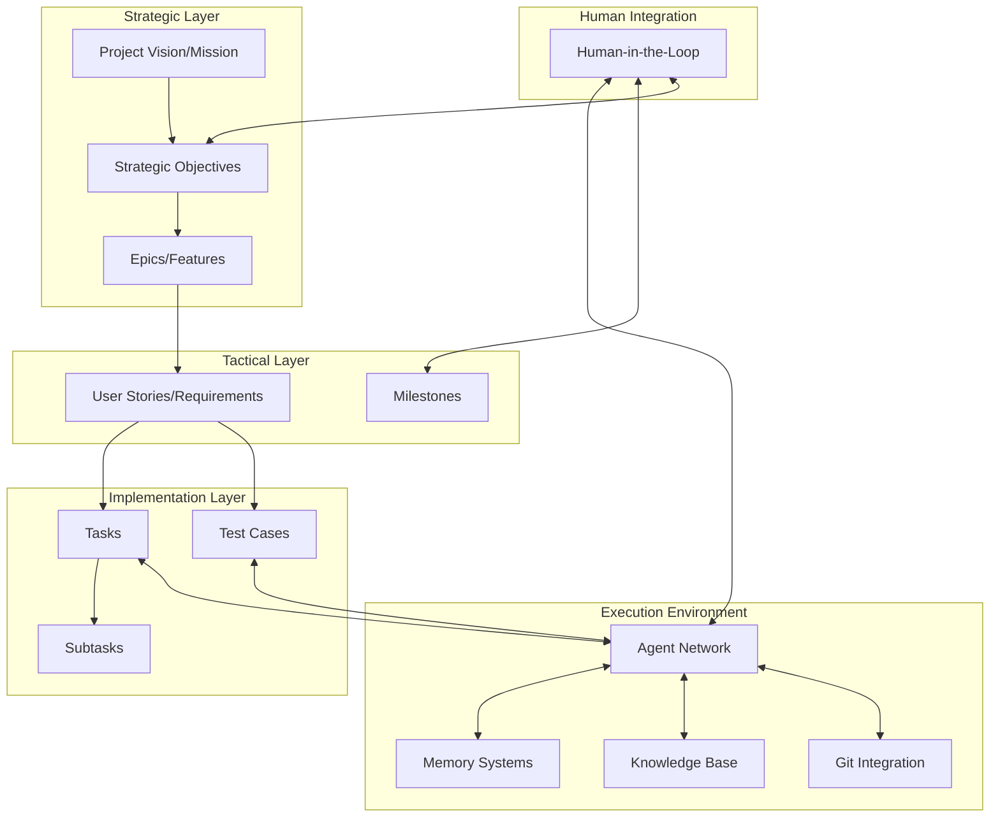
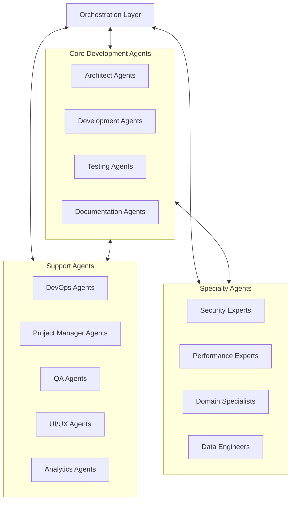
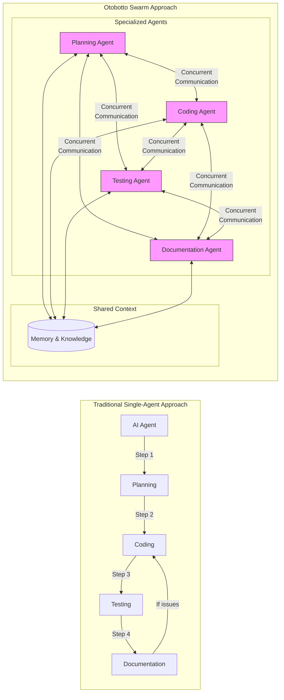
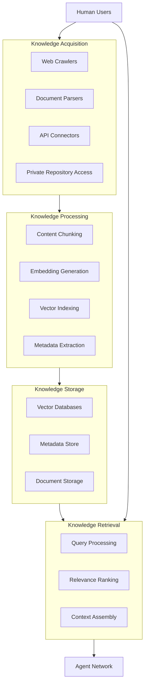
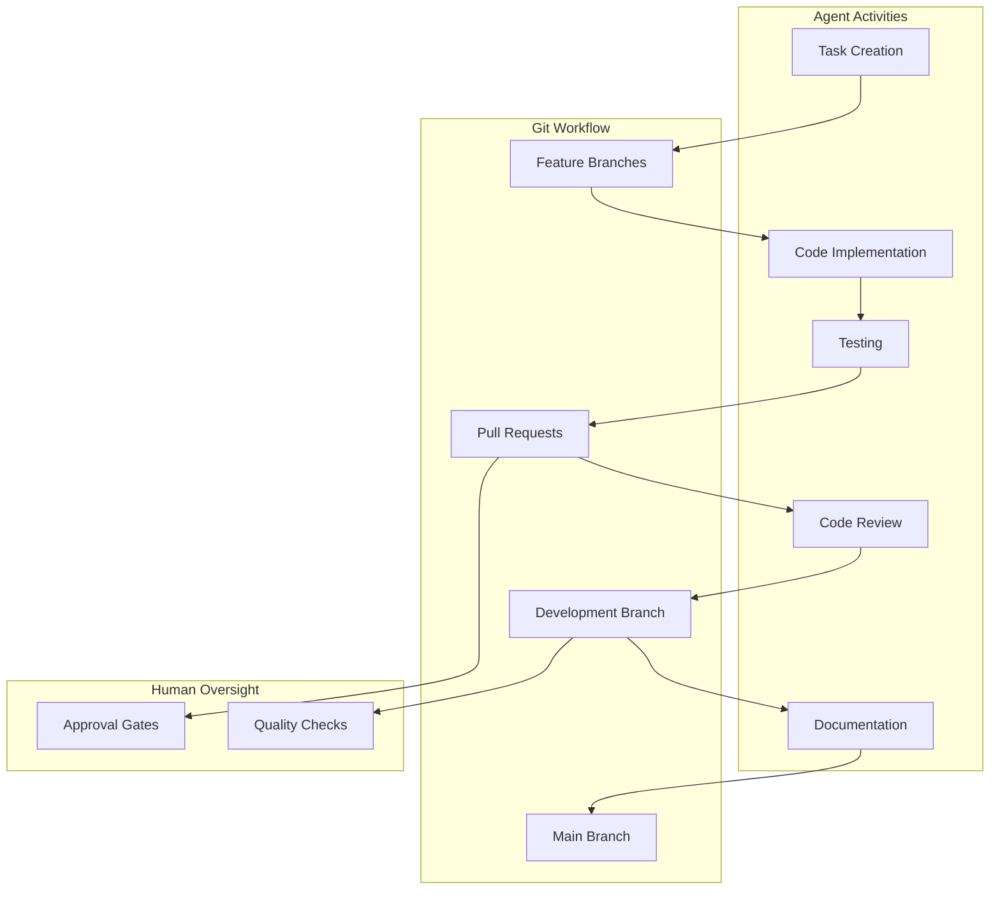
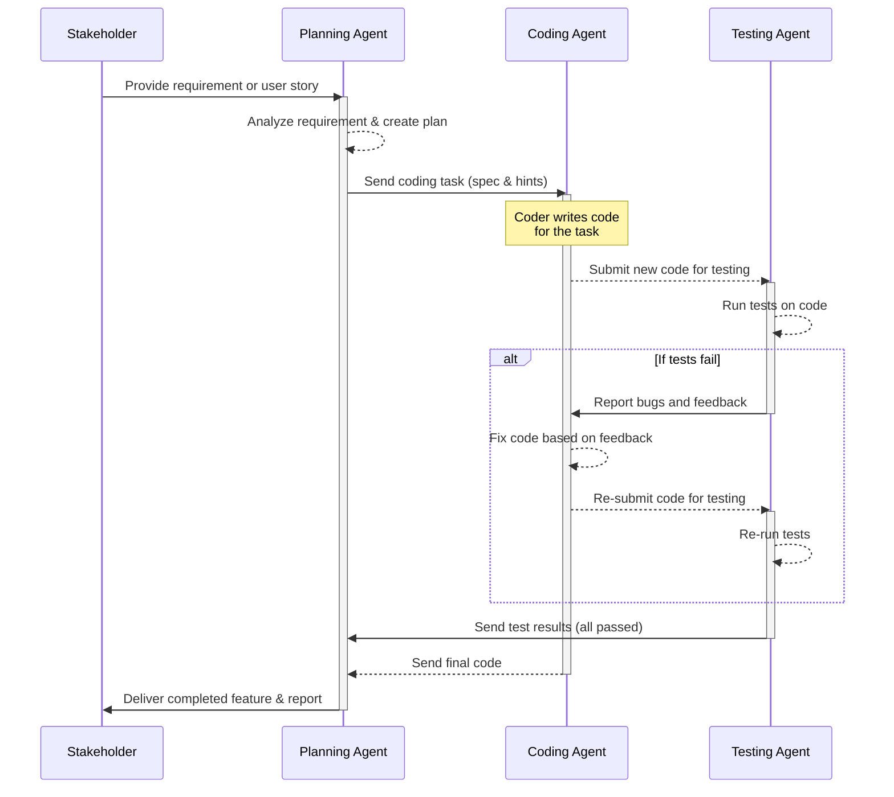
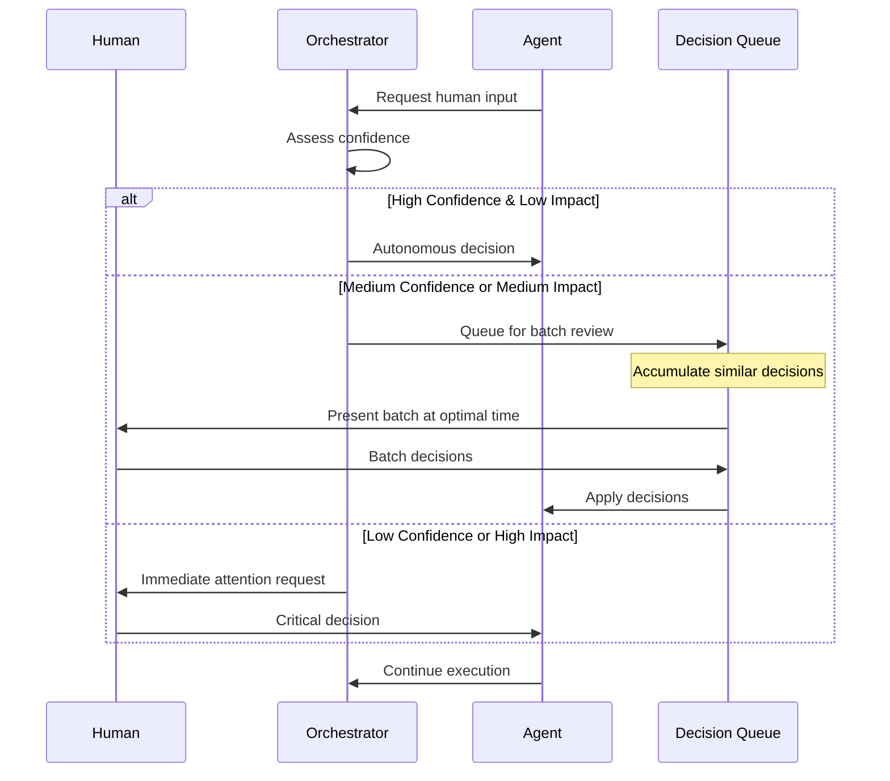

# Otobotto: An Autonomous AI Swarm Architecture for Enterprise Software Development

Jonathan Métillon
Independent Researcher
jonathan@livingstonlarus.com

## Abstract

This paper presents Otobotto, a proposed autonomous AI swarm architecture designed for enterprise-grade software development. While advancements in Large Language Models (LLMs) have fueled the rise of AI coding systems and specialized agent frameworks, industry leaders like Bret Taylor observe that we remain in an "Autopilot Era," where AI primarily augments human developers rather than enabling true autonomy [26]. We propose that Otobotto could address the significant gap between current capabilities and enterprise-grade development requirements through three key innovations: (1) a decentralized swarm coordination protocol that would enable true parallel development instead of sequential agent handoffs, (2) a hierarchical memory system with adaptive token optimization that could overcome context limitations in complex codebases, and (3) enterprise-grade verification through Git-native integration and test-driven development. Unlike systems such as Runic [15] and MetaGPT that use orchestrator-specialist models or sequential workflows, Otobotto would employ a dynamic, peer-based swarm architecture with specialized agents collaborating concurrently. This approach could enable continuous development, cross-verification, and integration while potentially reducing token consumption compared to naive implementations. This paper provides a theoretical framework for autonomous software engineering that addresses the complex requirements of enterprise environments and represents a potential step toward Taylor's vision of the "Autonomous Era" of software development.

## CCS Concepts
• Computing methodologies → Artificial intelligence → Knowledge representation and reasoning (I.2.4)
• Computing methodologies → Artificial intelligence → Planning and scheduling (I.2.8)
• Computing methodologies → Artificial intelligence → Multi-agent planning (I.2.11)
• Computing methodologies → Multi-agent systems → Multi-agent architectures (I.2.11)
• Computing methodologies → Distributed artificial intelligence → Multi-agent systems (I.2.11)
• Software and its engineering → Software organization and properties → Software system structures → Microservices (D.2.11)
• Software and its engineering → Software creation and management → Software development process management → Agile software development (D.2.9)
• Software and its engineering → Software creation and management → Software development process management → Software development productivity (D.2.9)
• Software and its engineering → Software creation and management → Software development techniques → Cloud computing (D.2.m)
• Software and its engineering → Software creation and management → Software verification and validation → Software defect analysis (D.2.4)
• Software and its engineering → Software creation and management → Software verification and validation → Software testing and debugging (D.2.5)
• Software and its engineering → Software creation and management → Maintaining software (D.2.7)
• Human-centered computing → Collaborative and social computing systems and tools (H.5.3)
• Security and privacy → Software and application security → Software security engineering (D.4.6)

## Keywords
Autonomous software development, AI swarm architecture, Multi-agent systems, Enterprise software engineering, Test-driven development, Git-native workflows, Human-in-the-loop AI, Software agent coordination, Memory hierarchy systems, Progressive autonomy, Large language models, Code generation

## 1. Introduction

As software systems grow increasingly complex, traditional development methodologies face significant challenges in maintaining quality, timeline adherence, and budgetary constraints. Enterprise software projects often involve millions of lines of code distributed across multiple interconnected services, requiring sophisticated coordination mechanisms that go beyond the capabilities of individual developers or teams. Concurrently, Large Language Models (LLMs) have demonstrated remarkable capabilities in code generation, problem-solving, and technical reasoning [1,2,3]. However, despite these advances, we remain in what industry leader Bret Taylor characterizes as the "Autopilot Era" of software development [26] - a state where AI primarily augments human developers rather than enabling true autonomy.

Recent years have seen rapid innovation in autonomous coding tools. GitHub Copilot and its enterprise version [6], Amazon CodeWhisperer, and Google's Gemini Code Assist provide increasingly sophisticated code completion and generation. More ambitious systems like Devin AI from Cognition, CodiumAI's Codiumate, and SuperAGI's SuperCoder [27] attempt greater autonomy through task-specific workflows or agent frameworks. Agent frameworks like E2B/AgentKit and AutoGen [28] enable the creation of specialized coding agents for particular tasks. However, these approaches still face significant limitations when applied to enterprise-scale development, particularly in achieving true autonomy and handling the full complexity of enterprise projects.

Quinn Slack, CEO of Sourcegraph, distinguishes between "horizontal agents" that automate specific, well-defined tasks (e.g., test generation, dependency updates) and "vertical agents" that attempt end-to-end development [29]. While horizontal agents have demonstrated success in enterprise environments, vertical agents struggle with the complexity, scale, and quality requirements of enterprise software. As Randy Zhang of Cisco Systems notes, even simple multi-agent conversations encounter technical limitations where "token consumption compounds exponentially, not linearly" [30], forcing most implementations to avoid true multi-agent coordination. This highlights a key challenge in scaling multi-agent systems for complex tasks.

The current landscape of autonomous coding systems and multi-agent architectures primarily falls into three categories, each with notable limitations for enterprise software development. First, single-agent systems like AutoGPT [11] and BabyAGI [12] demonstrate autonomy for sequential tasks but lack the parallel processing capabilities and specialization that would be required for complex enterprise projects. Second, orchestrator-specialist models such as Runic [15], which was a significant step forward with its parallel development approach, still rely on a centralized orchestrator that could become a bottleneck and single point of failure as project complexity increases. While Runic has shown promising results in increasing development velocity through parallel agent work and persistent memory systems, its file-based memory system and lack of Git-native workflows may limit its effectiveness for large-scale enterprise projects. Third, role-based assembly lines like MetaGPT assign roles such as product manager, architect, and programmer in a sequential workflow, mimicking traditional software development processes but without true parallel execution. While this approach provides structure, it may not adequately address the exponential token consumption issue identified by Zhang [30] and may lack the dynamic adaptability required for rapidly evolving enterprise requirements.

To date, none of these approaches have successfully addressed the inherent complexity of enterprise software projects, which require sophisticated coordination, parallel development, and continuous integration across diverse technical domains. As Taylor asks, "If a computer is generating most code, how do we make it easy for a software engineer to verify it does what they intend?" [26] This question underscores the need for systems that not only generate code but also ensure its correctness, maintainability, and alignment with evolving project goals.

We propose that Otobotto could address these limitations through a novel, decentralized swarm architecture that fundamentally reimagines AI-assisted development. Unlike sequential agent handoffs or orchestrator-centric models, Otobotto would implement a peer-based swarm approach with dynamic role optimization and sophisticated inter-agent communication protocols. This approach could enable genuine parallel development where multiple agent teams work concurrently on different components while maintaining architectural consistency through shared knowledge repositories and cross-verification mechanisms.

The key innovations that we believe would distinguish Otobotto from existing systems include a decentralized swarm coordination protocol, a hierarchical memory system with adaptive token optimization, enterprise-grade verification through Git-native integration, and test-driven development as a core principle.

The decentralized swarm coordination approach would differ from Runic's orchestrator-specialist model by implementing a dynamic coordination mechanism where leadership could emerge based on domain expertise and workload distribution. This might enable truly parallel development processes with multiple concurrent development tracks, potentially outperforming the sequential handoffs common in systems like MetaGPT.

For memory management, while current approaches like SuperAGI's "repository maps" [27] provide limited context awareness, Otobotto would implement a three-tier memory architecture (operational, project, and strategic) designed to maintain context across different temporal scales. Combined with adaptive token optimization techniques, this system could potentially reduce token consumption compared to naive implementations, addressing Zhang's exponential token consumption concern [30].

Unlike existing systems that treat version control as an external process, Otobotto would embed Git workflows directly into its architecture, enabling branch-based parallel development, automated code reviews, and continuous integration. This would address Taylor's verification concerns by making quality a fundamental aspect of the development process rather than an afterthought.

In contrast to systems that generate tests after implementation, Otobotto's specialized testing agents would develop test suites before implementation begins, ensuring that acceptance criteria are clearly defined and verified prior to coding. This approach could potentially lead to higher test coverage and more robust code.

This paper makes the following theoretical contributions: (1) a novel swarm-based architecture for autonomous software development that could enable genuinely parallel work through dynamic coordination; (2) a conceptual protocol for decentralized agent coordination that might reduce token consumption while maintaining coherent development; (3) a Git-native approach that would embed version control directly into the AI system's workflow; (4) a comprehensive test-driven development framework designed to maintain quality throughout the development process; (5) a hierarchical memory system with adaptive token optimization that could maintain persistent context across development sessions; and (6) an adaptive human-in-the-loop strategy that might progressively build trust rather than requiring constant oversight.

The remainder of this paper is organized as follows: Section 2 discusses background and related work in AI-assisted software development. Section 3 explains the proposed architecture of Otobotto, detailing its core components. Section 4 describes the technical implementation considerations. Section 5 presents potential evaluation methodologies. Section 6 discusses the implications and limitations of our proposed approach, and Section 7 concludes with future directions.

## 2. Background and Related Work

### 2.1 AI-Assisted Software Development

Recent advances in large language models (LLMs) have significantly improved AI capabilities in code generation and understanding. Models such as GitHub Copilot [6], based on OpenAI's Codex, have demonstrated the ability to generate contextually relevant code snippets. Similarly, AlphaCode [7] has shown competence in competitive programming tasks, while ChatGPT and GPT-4 [8] have exhibited broad capabilities in understanding and generating code across multiple programming languages.

However, these tools primarily function as assistants rather than autonomous developers, requiring substantial human guidance and having limited context understanding. Studies by Peng et al. [9] and Vaithilingam et al. [10] have shown that while these tools can increase productivity for specific tasks, they struggle with maintaining consistency across larger codebases and understanding complex software architectures.

### 2.2 Autonomous Coding Systems and Multi-Agent Architectures

Recent years have seen rapid evolution in autonomous coding systems, from AI coding assistants to more advanced agent architectures. These systems can be categorized into three generations: (1) code-completion assistants, (2) task-specific autonomous agents, and (3) end-to-end development systems attempting greater autonomy.

Early code assistants like GitHub Copilot [6] and Amazon CodeWhisperer provide in-editor suggestions to augment developer productivity. More recently, enhanced systems like GitHub Copilot Enterprise, Google's Gemini Code Assist, and Mode [31] have expanded capabilities to include functions like auto-merge, context-aware workspaces, and improved debugging support, yet remain fundamentally assistive rather than autonomous.

In the second generation, task-specific autonomous coding agents have emerged. Sourcegraph's Enterprise AI agents [29] demonstrate success in enterprise environments for specific tasks like test generation, code review, and dependency updates. Quinn Slack, Sourcegraph CEO, distinguishes these "horizontal agents" (focused on specific tasks) from "vertical agents" (attempting end-to-end development), noting that horizontal approaches have proven more practical in enterprise settings. These systems excel at well-defined, repetitive tasks but lack the broader context awareness needed for comprehensive development. Specific examples include agents for automated test execution [37] and dependency installation [38].

The third generation attempts greater autonomy through multi-agent systems and specialized frameworks. Leading examples include Devin AI from Cognition, CodiumAI's Codiumate, and SuperAGI's SuperCoder 2.0 [27]. These systems aim to handle more complex tasks and maintain longer-term context. Agent frameworks like E2B with AgentKit [28] and AutoGen [11] enable the creation of customized coding agents with specialized tools for filesystem operations, terminal commands, and code execution. SuperAGI identifies the "Last Mile Problem" as a key challenge, requiring AI agents to iterate through multiple stages of planning, development, and debugging to achieve working solutions. Recent research explores using reinforcement learning to improve LLM reasoning for software engineering tasks [32] and applying LLMs to automate aspects of penetration testing [33].

Multi-agent AI systems distribute tasks among specialized components, theoretically enabling more complex problem-solving than single-agent approaches. AutoGPT [11] and BabyAGI [12] demonstrated the potential of autonomous agents to perform sequential tasks without direct human intervention, while systems like LangChain [13] and CrewAI [14] provide frameworks for coordinating multiple LLM-based agents. However, as Randy Zhang from Cisco Systems notes, even simple multi-agent conversations encounter technical limitations where "token consumption compounds exponentially, not linearly" [30], forcing most implementations to avoid true multi-agent coordination. Research is also exploring how to best structure human-AI collaboration in software teams [39].

The Anunnaki framework [44] proposes a modular, composable approach to address multiple dimensions of uncertainty in Trusted AI, using loosely coupled services for tasks like domain detection and multi-domain training. This aligns with the trend towards specialized agents, but its primary focus is on run-time management and adaptation of learning-enabled systems (LESs) in general, rather than specifically targeting the complexities of enterprise software development with a swarm-based, multi-agent approach.

In the domain of software development, Runic [15], a precursor to Otobotto, introduced several key concepts that form the foundation for more advanced swarm architectures. Runic, inspired by the Cline Memory Bank [40] approach for maintaining context in AI-assisted coding, implemented a parallel development approach with structured roles (Orchestrator and Specialists) and a persistent, file-based memory system. The framework enabled multiple agents to work simultaneously on different aspects of a project, significantly increasing development velocity compared to sequential approaches. The Cline Memory Bank, implemented as a set of custom instructions for the Cline VS Code extension, demonstrated the value of structured documentation and context preservation for AI coding assistants. User experiences with the Cline Memory Bank, however, highlight challenges related to token consumption and the overhead of reading memory files before each task [42]. An extension to this, the Cline Recursive Chain of Thought (CRCT) system [43], attempted to address some limitations by adding dependency mapping, but, like Runic, it primarily targets smaller projects and lacks the enterprise-grade features of Otobotto.

While Runic and the Cline Memory Bank provided a valuable foundation, they had significant limitations: (1) their memory systems were primarily file-based rather than employing sophisticated vector storage or semantic search, (2) they lacked true Git-native workflows, instead treating version control as an external process, (3) they did not implement comprehensive test-driven development as a fundamental principle, and (4) their approach to human integration was relatively rudimentary. Additionally, most multi-agent systems in this domain, including those building upon the concepts of Runic and the Cline Memory Bank, generally employ sequential agent handoffs rather than true swarm coordination, limiting their ability to parallelize work and maintain context across the development lifecycle. Other research efforts focus on specific aspects of software development, such as automated software repair and requirement realization [38], and formal verification [34]. Tools like SpecStory [41] address the need for context preservation and sharing in AI-assisted coding but are limited to specific IDEs and lack the comprehensive architectural approach of Otobotto.

### 2.3 Enterprise Software Development Challenges

Enterprise software development presents unique challenges that current AI systems fail to address adequately. These include:

1. **System Complexity**: Enterprise applications often comprise millions of lines of code across multiple interconnected services, requiring consistent architectural vision [16].

2. **Knowledge Fragmentation**: Development knowledge is typically distributed across team members, making comprehensive understanding difficult for single-agent systems [17].

3. **Coordination Overhead**: As projects scale, maintaining coherence becomes exponentially more difficult, creating tension between innovation needs and standardization requirements [18].

4. **Technical Debt**: Long project lifecycles lead to accumulated technical debt that complicates maintenance and evolution [19].

5. **Compliance Requirements**: Regulated industries require strict adherence to standards that must be enforced throughout the development process [20].

### 2.4 Research Gap

Despite significant advancements in AI capabilities and growing interest in autonomous software development, a substantial gap exists between current solutions and the requirements for enterprise-grade development. As SuperAGI notes, "autonomous development" remains an unsolved challenge for complex projects, particularly when moving beyond "self-contained" tasks to end-to-end development of enterprise software [27]. Quinn Slack of Sourcegraph distinguishes between "horizontal agents" that automate specific tasks and "vertical agents" that attempt complete software development [29], noting that horizontal approaches have seen greater success in enterprise environments while vertical solutions remain elusive.

Taylor's vision of transitioning from the "Autopilot Era" to the "Autonomous Era" [26] raises fundamental questions about the role of software engineers as "operators of code generating machines" rather than authors of code. This transition requires not just incremental improvements to existing tools but a fundamental reimagining of the software development process itself. He asks, "Why shouldn't every program be verifiably correct and run incredibly efficiently if AI is doing all the work?" - highlighting the gap between current capabilities and the potential of truly autonomous systems.

While recent tools like Cursor's Agent Mode (with E2B and AgentKit implementations) [28], CodiumAI's Codiumate, and Devin AI from Cognition attempt greater autonomy, industry practitioners have identified significant limitations when applying these approaches to enterprise environments:

1. **Context and Token Management Challenges**: As Randy Zhang from Cisco Systems details, "Lost in the Middle" issues persist where LLMs struggle to extract valuable information from large context windows [30]. Current approaches like "repository maps" offer partial solutions but fall short for complex codebases. Runic [15] attempted to address this with token-efficient design but remained limited by file-based memory systems.

2. **Coordination Complexity**: Zhang notes that conversations between multiple agents consume tokens "exponentially, not linearly" [30], forcing most implementations to use single-agent conversations with sequential handoffs rather than true parallel coordination. Runic's Orchestrator/Specialist model represented progress but lacked sophisticated orchestration needed for true swarm intelligence.

3. **Quality Assurance Concerns**: As Taylor observes, "we are dramatically increasing the amount of software in the world, but that new software seems to contain the same security vulnerabilities and flaws as the code we were writing before, but with less oversight and maintainability" [26]. Testing remains an afterthought in most systems rather than a fundamental principle.

4. **Enterprise Requirements Gap**: According to Slack, autonomous development is most promising in enterprise environments where tasks occur "a hundred or a thousand or 10,000 times across their entire engineering org every single day" [29]. Yet current solutions lack robust enterprise integration capabilities for regulated industries and compliance frameworks.

5. **Human-AI Collaboration Models**: The transition from "coding assistant" to "autonomous agent" requires new paradigms for human oversight that balance autonomy with quality. Current systems lack sophisticated progressive autonomy models that build trust while maintaining productivity.

While Runic [15] took important steps toward parallel development with multiple AI agents, it was designed primarily for lighter-weight projects and lacked the robust infrastructure needed for enterprise-grade software development. To the best of our knowledge, no existing system comprehensively addresses the full scope of requirements for autonomous enterprise software development.

Otobotto addresses these limitations through a novel swarm-based approach that fundamentally reimagines AI-assisted development, expanding significantly on Runic's initial parallel development concept to provide a comprehensive framework that bridges the gap between the current "Autopilot Era" and the "Autonomous Era" that Taylor envisions.

## 3. Architecture Overview

The proposed Otobotto architecture would be designed to mirror proven software project management techniques while adapting them to an AI-native context. The system would follow a hierarchical decomposition approach that maintains coherence from high-level objectives to individual implementation tasks, significantly expanding on the initial concepts introduced by Runic [15] while addressing its limitations through a comprehensive enterprise-focused design.

**Figure 1:** Proposed hierarchical architecture showing strategic, tactical, and implementation layers with their interconnections to the execution environment.

While Runic introduced the concept of parallel development with specialized agents, Otobotto would aim to transform this approach into a more comprehensive swarm architecture with sophisticated coordination mechanisms, persistent memory hierarchies, and enterprise-grade quality assurance. The envisioned system would represent a potential advancement by more thoroughly integrating software engineering principles with AI capabilities.

### 3.1 Core Principles

The architectural foundation of the proposed Otobotto system would be built on four core principles to guide development activities. First, vision and mission alignment would ensure clear articulation of project goals, driving all development decisions and creating coherence across the system. Second, architectural integrity would establish principles to maintain technical coherence even as the system scales to larger projects. Third, risk management would incorporate proactive identification and mitigation strategies to address potential issues before they impact development. Finally, quality assurance would be embedded throughout the development lifecycle rather than applied as an afterthought.

These principles would work together to create a framework where autonomous agents could operate with sufficient guidance and constraints to produce high-quality, consistent software solutions. The emphasis on vision alignment would help ensure that technical implementation remains connected to business objectives, while architectural integrity principles would prevent the divergence that can occur when multiple agents work in parallel without sufficient coordination.

### 3.2 Project Decomposition Hierarchy

To manage complex enterprise projects effectively, Otobotto would implement a systematic seven-level decomposition hierarchy. At the highest level, the project vision and mission would establish the overarching purpose driving all decisions. This would be refined into strategic objectives that align with business value and define the project's goals in measurable terms. These objectives would then be broken down into epics and features, representing major functionality groups.

At a more tactical level, user stories and requirements would provide user-centered functionality descriptions that connect technical work to business needs. Milestones would establish key achievement points with clear evaluation criteria. At the implementation level, tasks would represent implementation-ready work items with clear acceptance criteria, while subtasks would be the individual work units that can be assigned to specific agents and verified upon completion.

This hierarchical approach to project decomposition would allow the system to maintain coherence between high-level business objectives and low-level implementation details. By establishing clear traceability from vision to subtasks, the system could potentially ensure that all development work contributes meaningfully to the project's goals, even when that work is distributed across multiple autonomous agents.

### 3.3 AI-Native Adaptations

Traditional software development methodologies would need to be adapted to an AI-native context for Otobotto to function effectively. Instead of using human-oriented timeframes, the system would employ computation-based units with metrics based on processing cycles, token consumption, and task completion. This approach would allow for more accurate estimation and tracking in an environment where work is performed by AI agents rather than human developers.

Git-native operations would integrate version control principles directly into the system, including automated management of branching strategies, pull requests, and code reviews. This would allow the system to maintain code quality and coordination without requiring external tooling or human intervention for routine version control tasks.

Test-driven development would be implemented through specialized agents that focus on creating comprehensive test suites before implementation begins. This would ensure that acceptance criteria are clearly defined and that code can be automatically verified against these criteria. Dynamic resource allocation would optimize costs by allocating computational resources based on task complexity and budget constraints, potentially making more efficient use of expensive LLM resources for complex tasks while using lighter-weight models for simpler work.

## 4. Core Components

### 4.1 Orchestration Layer

The proposed Otobotto architecture would feature an orchestration layer at its core, acting as a central coordination system for managing task allocation, dependency resolution, and agent communication. Unlike traditional orchestration systems that might create bottlenecks, this layer would be designed to facilitate rather than control, enabling emergent coordination among peer agents.

The orchestration layer would implement priority-based work distribution to ensure that critical tasks are addressed first, maintaining project momentum on essential features. Task dependency management would maintain proper sequencing of interdependent work, preventing situations where agents attempt to build features before their prerequisites are complete. Resource optimization would allocate computational resources efficiently based on task requirements, potentially reducing costs and improving performance by matching resource intensity to task complexity.

To provide transparency into the development process, the orchestration layer would include progress monitoring capabilities, offering real-time visibility into development status across all active tasks. When agents develop competing approaches to the same problem, conflict resolution mechanisms would determine the optimal path forward, either by selecting one solution or by synthesizing a hybrid approach that leverages the strengths of multiple proposals.

**Figure 2:** Proposed agent network showing the orchestration layer's coordination of specialized agent groups including core development, support, and specialty agents.

### 4.2 Agent Network

The Otobotto agent network would comprise specialized AI agents with defined roles, working together as the core workforce of the system. These specialized agents would be designed to handle different aspects of the software development process, bringing focused expertise to particular challenges.

Architect agents would handle system design and technical decision-making, establishing the overall technical direction and ensuring architectural coherence across the project. Development agents would implement functionality across various technology stacks, translating designs and requirements into working code. Testing agents would design, execute, and validate tests to ensure quality, implementing the test-driven development approach that is central to the proposed methodology.

Documentation agents would manage code documentation and knowledge capture, ensuring that the system maintains comprehensive and up-to-date documentation. DevOps agents would handle build, deployment, and infrastructure management, integrating DevOps practices directly into the development process. Project manager agents would coordinate tasks, manage timelines, and allocate resources, providing the project management capabilities necessary for large-scale developments.

Quality assurance agents would provide oversight beyond testing, including usability assessment and other quality measures. Security agents would perform vulnerability assessment, compliance verification, and threat modeling, ensuring that security considerations are addressed throughout the development process rather than being added as an afterthought.

This modular approach to agent specialization would create a flexible architecture that could be extended with additional specialized agents as project needs evolve. For example, domain-specific agents could be added to provide expertise in particular business domains like finance, healthcare, or e-commerce.

**Figure 7:** Comparison between a traditional single-agent approach (sequential processing) and Otobotto's swarm architecture (parallel processing with shared context). The swarm approach would enable concurrent work on different aspects of development while maintaining coordination through shared knowledge and inter-agent communication.

### 4.3 Knowledge Infrastructure

#### 4.3.1 Retrieval-Augmented Generation (RAG) System

The proposed Otobotto system would implement a robust knowledge acquisition and processing system designed to enhance agent capabilities through contextual information. This Retrieval-Augmented Generation (RAG) system would allow agents to access and utilize diverse knowledge sources relevant to their tasks.

Documentation crawlers would be specialized by source type to gather information from various repositories, including public documentation, code examples, and technical blogs. Enterprise knowledge connectors would securely access private repositories, enabling the system to incorporate proprietary information while maintaining appropriate security controls. Domain-specific research agents would gather specialized information relevant to project needs, focusing on particular technical domains or business requirements.

A structured knowledge representation system would ensure effective retrieval when needed, organizing information in ways that make it accessible and useful to the agents. This approach would help address the challenge of providing agents with sufficient context to make informed decisions without overwhelming them with irrelevant information.

**Figure 3:** Proposed knowledge infrastructure showing the flow of information from acquisition through processing and storage to retrieval and utilization by agents.

#### 4.3.2 Hierarchical Memory System

To address the challenge of maintaining context across different timeframes, Otobotto would implement a three-tiered hierarchical memory architecture. This system would be designed to efficiently manage information across different temporal scales, ensuring that critical knowledge is maintained and accessible when needed.

Operational memory would provide short-term storage for real-time agent communication and context, allowing agents to maintain awareness of ongoing activities and recent developments. This would enable effective collaboration during active development sessions. Project memory would serve as mid-term storage for project-specific knowledge and decisions, maintaining a record of architectural choices, implemented features, and other information relevant to the current project. This would help ensure consistency across the development lifecycle, even as different agents work on different aspects of the project.

Strategic memory would function as long-term storage for patterns, best practices, and cross-project learnings, building up a knowledge base that could be applied to future projects. This would allow the system to improve over time, learning from successes and challenges across multiple projects.

By segmenting memory into these three tiers, the system could potentially manage the context more efficiently than approaches that treat all information equally. This could help address the exponential token consumption issue identified by Zhang [30] and enable more effective long-term learning.

### 4.4 Git Integration Layer

A distinctive feature of the proposed Otobotto system would be its direct integration with version control systems, embedding software engineering best practices into the development process. This Git-native approach would differ from existing agent systems that typically treat version control as an external process.

Automated branch management would enable parallel development across multiple features, allowing the system to maintain separate branches for different areas of work and preventing conflicts between concurrent development efforts. Pull request lifecycle automation would streamline code review and integration, managing the creation, review, and merging of pull requests as code moves through the development process.

Code review and approval workflows would ensure that quality standards are maintained, with automated checks as well as optional human oversight at critical points. Issue and ticket integration would connect development activities to work tracking systems, maintaining traceability between requirements, tasks, and the code that implements them.

**Figure 4:** Proposed Git-native workflow showing the integration between version control processes and agent activities, with strategic human oversight at key approval gates.

### 4.5 Testing and Verification Framework

In line with its emphasis on quality, Otobotto would implement a comprehensive test-driven development approach intended to ensure quality throughout the development process. This approach would differ from many current systems where testing is often treated as a verification step after implementation.

Contract design and test specification would occur before implementation, establishing clear expectations for functionality, performance, and other requirements. This would provide a foundation for the development process and a clear standard for success. Multi-level testing would span unit, integration, and system levels to verify behavior at different scopes, ensuring that components work correctly both individually and in combination.

Specialized frontend and UI testing would address the unique challenges of user interfaces, verifying both visual correctness and interactive behavior. Performance and security verification would ensure that non-functional requirements are met, addressing important aspects that might otherwise be overlooked.

By placing testing at the beginning of the development process rather than the end, this approach would aim to prevent defects rather than merely detecting them. This could potentially lead to higher quality code and more reliable systems, while potentially reducing the overall development time by minimizing rework.

**Figure 6:** Proposed task workflow in Otobotto – showing how specialized agents would collaborate on a development task from requirement gathering through implementation and testing, with iterative correction loops when tests fail.

## 5. Technical Implementation

### 5.1 Containerization and Execution Environments

The implementation of an autonomous AI swarm architecture like Otobotto would require secure, scalable environments for agent operation. We envision a containerization approach that would provide both the isolation and flexibility needed for complex enterprise development tasks.

Kubernetes orchestration would serve as the foundation for container management, deployment, and scaling, allowing the system to efficiently manage computational resources across multiple agents and tasks. This containerized approach would enable the system to scale horizontally as needed while maintaining isolation between different components. For rapid testing and execution of generated code, E2B environments could provide ephemeral, secure execution with fast spin-up times, allowing agents to quickly verify their outputs without extensive setup.

WebAssembly sandboxing might offer lightweight containerization for code execution and testing, providing additional security through a standardized binary format that executes in isolated environments. Secure execution boundaries would prevent unintended system interactions, an essential consideration for enterprise environments where security is paramount. Dynamic resource allocation would allow the system to scale computational resources based on task requirements, potentially optimizing costs by allocating resources where they are most needed.

This containerized approach would differ from simpler agent implementations by providing a production-grade execution environment capable of handling enterprise workloads securely and reliably. The combination of Kubernetes for orchestration and WebAssembly for sandboxing could create a secure, efficient environment for agent operations.

### 5.2 Inter-Agent Communication

Effective collaboration among autonomous agents would require robust messaging infrastructure that enables coordination across distributed environments. The proposed system would implement several key components to facilitate this communication.

Distributed message queues using technologies such as Kafka or RabbitMQ could provide high-throughput, reliable delivery of messages between agents. This approach would ensure that agent communications are durable and can survive temporary outages or restarts. An event-driven workflow engine would coordinate complex multi-step processes, allowing agents to trigger appropriate actions in response to system events.

State synchronization mechanisms would maintain a shared understanding across agents, ensuring that all participants have a consistent view of the project status. This would be particularly important when multiple agents are working in parallel on different aspects of the same project. Prioritization protocols would handle messages based on task importance and dependencies, ensuring that critical communications receive appropriate attention.

Unlike simpler agent systems where communication often happens through direct API calls or shared memory, this distributed messaging approach could potentially scale to support many concurrent agents working on complex projects. The architecture would be designed to avoid bottlenecks that might occur when many agents need to communicate simultaneously.

### 5.3 Vector Databases for Long-Term Memory

Effective knowledge management is a critical challenge for autonomous software development systems. For Otobotto, we propose the use of semantic storage solutions for code understanding and knowledge retrieval. This approach would build on emerging best practices in vector databases and embedding models.

Embedding generation using models such as OpenAI Embeddings or Sentence Transformers would convert code, documentation, and other text into vector representations that capture semantic meaning. These embeddings would then be stored in vector databases like Pinecone, Weaviate, or Milvus, enabling efficient similarity search across large repositories of code and documentation.

Context pruning techniques would identify and preserve the most relevant information, addressing the challenge of limited context windows in current LLMs. This would be particularly important for large projects where the total context exceeds what can be processed in a single LLM request. Hierarchy-aware indexing would organize information according to the project decomposition hierarchy, allowing for more targeted retrieval based on the current development context.

This approach to knowledge management would potentially overcome the limitations of file-based memory systems like those used in Runic [15], providing more nuanced semantic understanding and more efficient retrieval of relevant information. The vector database approach could also scale more effectively to enterprise-sized codebases with millions of lines of code.

### 5.4 Token Economy and Cost Management

Working with large language models at enterprise scale requires careful attention to computational costs. The proposed Otobotto system would implement sophisticated token optimization to manage these costs effectively.

Token usage tracking would provide granular monitoring of consumption by agent and task, creating transparency around resource utilization and enabling targeted optimizations. Budget controls would establish configurable limits at project, feature, and task levels, preventing unexpected cost overruns and ensuring that resources are allocated according to priority.

Model selection optimization would dynamically route requests between models based on task complexity, using more powerful (and typically more expensive) models only when necessary. This approach could potentially reduce costs without sacrificing quality by matching model capabilities to task requirements. Token efficiency techniques would include prompt compression, context pruning, and response summarization, all aimed at reducing the number of tokens processed for a given task.

These approaches to token economy and cost management could help address one of the key challenges identified by Zhang [30], where token consumption compounds exponentially in multi-agent systems. By implementing systematic token optimization, Otobotto might achieve significant cost reductions compared to naive implementations.

### 5.5 Security and Compliance Framework

Enterprise software development requires robust security and compliance measures. The proposed Otobotto system would implement enterprise-grade security throughout its architecture to meet these requirements.

Execution isolation would create sandboxed environments for untrusted code execution, preventing potentially malicious or buggy code from affecting the broader system. Data access controls would implement role-based access to sensitive project information, ensuring that agents only have access to the information necessary for their assigned tasks. Authentication and authorization systems would support multi-factor authentication and fine-grained permissions, providing enterprise-grade security for system access.

Comprehensive audit logging would track all system activities for accountability, creating a record of agent actions and decisions that could be reviewed if issues arise. Compliance support would include capabilities for addressing requirements from frameworks such as SOC 2, GDPR/CCPA, and industry-specific regulations, making the system suitable for use in regulated environments.

These security and compliance measures would be essential for enterprise adoption, particularly in industries with strict regulatory requirements such as finance, healthcare, and government. By incorporating these capabilities into the core architecture rather than treating them as add-ons, Otobotto could potentially address security concerns that might otherwise limit the adoption of autonomous development systems.

## 6. Human Integration Framework

### 6.1 Adaptive Human-in-the-Loop Strategy

While autonomous operation is a key goal, any practical enterprise software development system must effectively integrate human expertise and oversight. The proposed Otobotto system would implement a balanced approach to human oversight that aims to maximize autonomy while maintaining quality through thoughtful integration of human guidance.

Interaction scheduling would demonstrate awareness of human availability across time zones and work schedules, ensuring that requests for input happen at appropriate times. This approach would acknowledge the reality that humans have limited availability and would structure the system's operations to accommodate these constraints. Decision queuing would enable non-blocking accumulation of items requiring human input, allowing the system to continue productive work while waiting for human decisions on non-blocking items.

Confidence scoring would provide automated assessment of when human review is necessary, potentially reducing unnecessary interruptions while ensuring appropriate oversight for uncertain or high-risk decisions. Bundle optimization would group related decisions to minimize interruptions, increasing human efficiency by allowing multiple related items to be addressed in a single review session.

**Figure 5:** Proposed human-in-the-loop interaction patterns, showing different paths based on confidence levels and impact assessment, potentially enabling appropriate human oversight while maintaining development momentum.

This adaptive approach to human integration would differ from simpler models where humans must either continuously monitor the system or only see the final results. By intelligently managing when and how human input is requested, the system could potentially make more efficient use of human expertise while maintaining development momentum.

### 6.2 Progressive Autonomy Model

Integrating autonomous systems into established software development processes requires building trust over time. The proposed Otobotto system would implement a progressive autonomy model that gradually builds trust through a carefully designed progression of capabilities.

An initial high-oversight phase would include frequent checkpoints to demonstrate reliability to stakeholders. During this phase, the system would operate with significant human supervision, allowing stakeholders to observe its capabilities and limitations firsthand. This could help build confidence in the system's operations while providing valuable feedback for improvement.

As the system demonstrates reliability, metrics-based autonomy expansion would gradually increase its autonomy based on demonstrated performance across various tasks. This data-driven approach would ensure that autonomy increases only as the system proves its capabilities, potentially reducing risk while maximizing the benefits of automation.

Decision confidence indicators would help humans understand the system's certainty level when making decisions or recommendations. This transparency could help human overseers judge when to trust the system's outputs and when more careful review might be necessary. Explainability features would provide insight into significant decisions, helping humans understand the reasoning behind the system's actions and potentially building trust through transparency.

This progressive approach to autonomy could allow organizations to adopt autonomous development capabilities at a pace that matches their comfort level and the system's demonstrated reliability. Rather than forcing an all-or-nothing choice between human and autonomous development, it would create a smooth transition path that could potentially increase acceptance and effectiveness.

### 6.3 Continuity Management

A challenge for any autonomous system working with human collaborators is maintaining productivity during periods of human unavailability. The proposed Otobotto system would implement several strategies to maximize productivity while respecting human constraints.

Weekend and overnight planning would focus on non-blocking work that can proceed without human intervention during periods when humans are typically unavailable. This approach could take advantage of the system's 24/7 availability while respecting the reality that humans need time away from work. Critical path analysis would prioritize work that won't create dependencies requiring human decisions, ensuring that the system can make progress on important tasks even when humans aren't available to provide input.

Parallel track development would route around human decision points when possible, allowing work to continue on aspects of the project that don't currently require human input. This approach could maintain momentum even when specific decisions are awaiting human review. Predictive scheduling would anticipate human availability and plan accordingly, potentially learning patterns of availability and scheduling work to align with these patterns.

These continuity management strategies could help address one of the key limitations of human-only development: the constraints of human working hours and availability. By intelligently managing work to accommodate these constraints, the system could potentially achieve greater productivity while maintaining appropriate human oversight.

## 7. Future Evaluation Considerations

Future work will need to include thorough empirical evaluation of the Otobotto architecture once implemented. This evaluation should examine several key aspects of the system's performance:

### 7.1 Key Evaluation Dimensions

Any comprehensive assessment of the Otobotto architecture would need to consider:

1. **Development Efficiency**: How the swarm architecture affects development speed and resource utilization compared to existing approaches.

2. **Code Quality**: Whether the test-driven approach and specialized agent roles result in measurable improvements to code correctness, maintainability, and security.

3. **Human-AI Collaboration**: The effectiveness of the progressive autonomy model in building trust and reducing necessary oversight while maintaining quality.

4. **Scalability**: How well the architecture handles increasing project complexity and whether the token optimization approaches effectively address the exponential context challenges identified by Zhang [30].

### 7.2 Implementation Considerations

Any implementation of this architecture would need to address several practical challenges:

1. **Engineering Complexity**: Implementing the complete set of interacting components would require substantial engineering effort, suggesting a phased approach to development and evaluation.

2. **Model Dependencies**: The architecture's effectiveness would be tied to the capabilities of the underlying LLMs, requiring adaptation as foundation models continue to evolve.

3. **Enterprise Integration**: Testing in real enterprise environments would be necessary to validate the architecture's compatibility with existing development ecosystems and workflows.

These considerations would shape the implementation roadmap for transforming the Otobotto concept into a practical system for enterprise software development.

## 8. Discussion

### 8.1 Potential Advantages

Based on the proposed architecture, a multi-agent swarm approach like Otobotto could potentially address several limitations of current AI coding assistants in enterprise software development. Key potential advantages include:

1. **Swarm Coordination Benefits**: The decentralized peer-based approach could outperform single-agent systems by allowing multiple specialized agents to collaborate on complex tasks, potentially leading to more comprehensive solutions than any single agent could produce.

2. **Progressive Autonomy Potential**: The proposed trust-building approach might effectively reduce required human oversight while maintaining quality standards, potentially making autonomous systems more acceptable in enterprise environments.

3. **Git-native Integration**: Embedding version control directly into the architecture could improve coordination and reduce conflicts compared to systems that treat version control as an external process.

4. **Test-driven Methodology**: The emphasis on testing before implementation could lead to higher test coverage and fewer defects than approaches that treat testing as a verification step after implementation.

### 8.2 Anticipated Challenges

Despite these potential advantages, several challenges would likely need to be addressed:

1. **Initial Setup Complexity**: Configuring such a system for a new project would require significant upfront effort, though this could potentially be amortized over the project lifecycle as the system learns domain-specific knowledge.

2. **Knowledge Acquisition Requirements**: While the system could acquire domain knowledge over time, initial setup would likely benefit from domain expertise to guide effective knowledge acquisition and establish appropriate constraints.

3. **Coordination Complexity**: In highly interdependent tasks, agents might develop conflicting approaches that could require human resolution, particularly in domains with ambiguous or competing requirements.

4. **Foundation Model Dependency**: The system's performance would be inherently tied to the capabilities of underlying foundation models, which would create variability across implementations and over time as models evolve.

### 8.3 Implications for Software Engineering Practice

If successful, Otobotto and similar systems could drive several shifts in software engineering practice:

1. **Role Evolution**: Human developers might transition toward higher-level architectural guidance and creative problem-solving rather than implementation details, becoming "operators" of code-generating systems rather than direct authors.

2. **Continuous Validation Emphasis**: With automated implementation, continuous validation would become more critical to ensure alignment with business objectives and adherence to architectural principles.

3. **Knowledge Capture Importance**: Structured knowledge capture could become essential for effective autonomous development, potentially changing documentation practices to focus on capturing design intent rather than implementation details.

4. **Skills Transformation**: Developer skills might shift toward effective prompting, system configuration, and validation rather than direct coding, requiring new educational approaches and career pathways.

## 9. Future Work

Several promising directions for future research emerge from this conceptual work:

1. **Agent Specialization Research**: Investigating optimal boundaries between agent responsibilities and specialization levels to determine the most effective division of labor for different project types.

2. **Memory Architecture Advancement**: Developing and testing more sophisticated approaches to maintaining context and knowledge across development sessions, particularly for long-running enterprise projects.

3. **Autonomy Progression Frameworks**: Refining metrics and approaches for gradually increasing system autonomy while maintaining trust and alignment with business objectives.

4. **Cross-project Knowledge Transfer**: Exploring methods for enabling knowledge transfer between related projects to improve efficiency and quality without compromising security or intellectual property boundaries.

5. **Formal Verification Integration**: Incorporating formal verification techniques to provide stronger guarantees for critical system components, potentially addressing regulatory requirements in highly regulated industries.

6. **Automatic Rule Derivation**: Exploring methods for automatically deriving project-specific rules and best practices from agent interactions and code changes, similar to the experimental feature in SpecStory [42].

## 10. Conclusion

This paper has presented Otobotto, a proposed autonomous AI swarm architecture designed specifically for enterprise-grade software development. The conceptual framework addresses the critical gap between current AI coding assistants and the requirements of complex enterprise environments.

The theoretical contributions of this work include:

1. **A formalized decentralized swarm coordination protocol** that would enable true parallel development rather than sequential agent handoffs or centralized orchestration. This approach could potentially allow multiple concurrent development tracks while maintaining architectural consistency across components, representing an advancement over the orchestrator-specialist models used in systems like Runic [15] or the sequential role-based workflows of MetaGPT.

2. **A hierarchical memory architecture with adaptive token optimization** that could reduce token consumption while maintaining comprehensive context awareness. This approach directly addresses the "token consumption compounds exponentially, not linearly" challenge identified by Zhang [30] that has limited previous multi-agent systems.

3. **An enterprise-grade verification methodology** integrating Git-native workflows, test-driven development, and progressive human oversight. This comprehensive approach to quality assurance could potentially yield higher test coverage and maintainability than conventional approaches.

4. **A novel human integration framework** that could progressively reduce required human oversight while shifting human involvement from technical implementation to higher-value activities like architectural guidance and complex business rule verification.

Our proposal builds upon and extends the foundation laid by systems like Runic [15], addressing its limitations through a more sophisticated peer-based coordination model rather than a centralized orchestrator. In contrast to "horizontal agents" that focus on specific tasks (as described by Slack [29]) or "vertical agents" with limited coordination capabilities, Otobotto proposes a true swarm intelligence paradigm where specialized agents would collaborate across the entire software development lifecycle.

As industry leader Bret Taylor notes, we stand at the threshold between the "Autopilot Era" of software development, where AI assists human developers, and the potential "Autonomous Era," where software engineers transition "from being the author of computer code to being the operator of a code generating machine" [26]. The Otobotto concept represents a step toward this vision by addressing Taylor's core concerns about verification, quality, and maintainability in AI-generated code.

The implications of this conceptual framework extend beyond theoretical improvements. As foundation models continue to advance, the architectural patterns proposed in Otobotto could provide a template for integrating these capabilities into enterprise environments while maintaining the quality standards and governance requirements necessary for production deployment. This suggests a future where human developers focus increasingly on high-level design, creative problem-solving, and business alignment rather than implementation details.

Looking forward, we believe that frameworks like the proposed Otobotto architecture that coordinate specialized agents within structured software engineering practices could play an increasingly important role in bridging the gap between the current "Autopilot Era" and the "Autonomous Era" that Taylor envisions. By providing a comprehensive approach to autonomous development that addresses the unique requirements of enterprise environments, this work opens new possibilities for AI-human collaboration in building more reliable, efficient, and maintainable software systems.

## Acknowledgments

The author would like to thank the reviewers for their valuable feedback and suggestions that helped improve this paper.

## References

[1] T. B. Brown et al., "Language Models are Few-Shot Learners," in Advances in Neural Information Processing Systems, 2020, vol. 33, pp. 1877–1901.

[2] M. Chen et al., "Evaluating Large Language Models Trained on Code," arXiv preprint arXiv:2107.03374, 2021.

[3] OpenAI, "GPT-4 Technical Report," arXiv preprint arXiv:2303.08774, 2023.

[4] D. Dohan et al., "Towards a unified agent with foundation models," arXiv preprint arXiv:2307.09288, 2023.

[5] S. Mialon et al., "Augmented language models: a survey," arXiv preprint arXiv:2302.07842, 2023.

[6] GitHub, "GitHub Copilot," 2024. [Online]. Available: https://github.com/features/copilot

[7] Y. Li et al., "Competition-Level Code Generation with AlphaCode," Science, vol. 378, no. 6624, pp. 1092–1097, 2022.

[8] OpenAI, "GPT-4 Technical Report," arXiv preprint arXiv:2303.08774, 2023.

[9] Z. Peng et al., "Investigating and improving the Comprehensiveness of LLM-generated code," arXiv preprint arXiv:2402.15779, 2024.

[10] P. Vaithilingam et al., "Expectation vs. Experience: Evaluating the Usability of Code Generation Tools Powered by Large Language Models," in Proceedings of the 2022 CHI Conference on Human Factors in Computing Systems, 2022, pp. 1–15.

[11] S. Mann, "AutoGPT: An Autonomous GPT-4 Experiment," GitHub repository, 2023. [Online]. Available: https://github.com/Significant-Gravitas/Auto-GPT

[12] Y. Nakajima, "BabyAGI," GitHub repository, 2023. [Online]. Available: https://github.com/yoheinakajima/babyagi

[13] LangChain, "LangChain: Building applications with LLMs through composability," GitHub repository, 2023. [Online]. Available: https://github.com/langchain-ai/langchain

[14] J. Briggs, "CrewAI: Orchestrate Role-Playing Autonomous AI Agents," GitHub repository, 2023. [Online]. Available: https://github.com/joaomdmoura/crewAI

[15] J. Métillon, "Runic: A Framework for LLM-powered Development," 2023. [Online]. Available: https://github.com/metillon/runic

[16] M. Fowler, "Software Architecture Guide," martinfowler.com, 2019. [Online]. Available: https://martinfowler.com/architecture/

[17] D. E. Perry and A. L. Wolf, "Foundations for the Study of Software Architecture," ACM SIGSOFT Software Engineering Notes, vol. 17, no. 4, pp. 40–52, 1992.

[18] J. Bosch, "Design and Use of Software Architectures: Adopting and Evolving a Product-Line Approach," ACM SIGSOFT Software Engineering Notes, vol. 25, no. 6, pp. 96, 2000.

[19] W. Cunningham, "The WyCash Portfolio Management System," OOPSLA '92, 1992.

[20] L. Bass, P. Clements, and R. Kazman, "Software Architecture in Practice," Addison-Wesley Professional, 2012.

[21] N. B. Sandoval et al., "Lost in the Middle: How Language Models Use Long Contexts," arXiv preprint arXiv:2307.03172, 2023.

[22] Y. Tay et al., "Transformer Memory as a Differentiable Search Index," arXiv preprint arXiv:2202.06991, 2022.

[23] M. Jambon et al., "A Survey of Human-AI Collaboration for Software Development," arXiv preprint arXiv:2402.00415, 2024.

[24] M. Cohn, "Succeeding with Agile: Software Development Using Scrum," Addison-Wesley Professional, 2009.

[25] S. Amershi et al., "Software Engineering for Machine Learning: A Case Study," in Proceedings of the 41st International Conference on Software Engineering: Software Engineering in Practice, 2019, pp. 291–300.

[26] B. Taylor, "Building in the Era of Autonomous Software Development," Personal blog, December 2024. [Online]. Available: https://medium.com/@bretttaylor/building-in-the-era-of-autonomous-software-development-7a52f2b1c2b0

[27] M. Aslan, "Autonomous Software Development is here!" SuperAGI blog, May 2024. [Online]. Available: https://superagi.com/autonomous-software-development/

[28] C. Poly, "Replicating Cursor's Agent Mode with E2B and AgentKit," E2B.dev blog, February 2025. [Online]. Available: https://e2b.dev/blog/replicating-cursors-agent-mode-with-e2b-and-agentkit

[29] Q. Slack, "Enterprise Impact of AI Coding Agents," Sourcegraph Summit presentation, June 2024. [Online]. Available: https://www.sourcegraph.com/resources/enterprise-impact-of-ai-coding-agents

[30] R. Zhang and S. Aggarwal, "Building AI Agents to Automate Enterprise-Level Software Development: A Practical Perspective," Medium, November 2024. [Online]. Available: https://medium.com/@randyhzhang/building-ai-agents-to-automate-enterprise-level-software-development-a-practical-perspective-cef0c40d80e7

[31] M. Aslan, "Mode launches autonomous coding!" .Net Programming, January 2025. [Online]. Available: https://medium.com/dotnet-programming/mode-launches-autonomous-coding-5d3e7d2b895c

[32] Y. Wei, O. Duchenne, J. Copet, Q. Carbonneaux, L. Zhang, D. Fried, G. Synnaeve, R. Singh, and S. I. Wang, "SWE-RL: Advancing LLM Reasoning via Reinforcement Learning on Open Software Evolution," arXiv preprint arXiv:2502.18449, 2025.

[33] S. Nakatani, "RapidPen: Fully Automated IP-to-Shell Penetration Testing with LLM-based Agents," arXiv preprint arXiv:2502.16730, 2025.

[34] A. Kumar, D. N. Gadde, K. K. Radhakrishna, and D. Lettnin, "Saarthi: The First AI Formal Verification Engineer," arXiv preprint arXiv:2502.16662, 2025.

[35] Y. Xiao, R. Wang, L. Kong, D. Golac, W. Wang, "CSR-Bench: Benchmarking LLM Agents in Deployment of Computer Science Research Repositories," arXiv preprint arXiv:2502.06111, 2025.

[36] I. Bouzenia, M. Pradel, "You Name It, I Run It: An LLM Agent to Execute Tests of Arbitrary Projects," arXiv preprint arXiv:2412.10133, 2024.

[37] L. Milliken, S. Kang, S. Yoo, "Beyond pip install: Evaluating LLM Agents for the Automated Installation of Python Projects," arXiv preprint arXiv:2412.06294, 2024.

[38] A. B. Liu and Z. Chi, "From Defects to Demands: A Unified, Iterative, and Heuristically Guided LLM-Based Framework for Automated Software Repair and Requirement Realization," arXiv preprint arXiv:2412.05098, 2024.

[39] B. Klieger, C. Charitsis, M. Suzara, S. Wang, N. Haber, J. C. Mitchell, "ChatCollab: Exploring Collaboration Between Humans and AI Agents in Software Teams," arXiv preprint arXiv:2412.01992, 2024.

[40] N. Baumann, "Cline Memory Bank - Custom Instructions," GitHub repository, 2023. [Online]. Available: https://github.com/cline/cline/blob/main/docs/prompting/custom%20instructions%20library/cline-memory-bank.md

[41] SpecStory, "SpecStory Documentation," 2024. [Online]. Available: https://docs.specstory.com/

[42] Reddit, "Cline and memory-bank experiences - latest build w/ sonnet 3.7," Reddit thread, 2024. [Online]. Available: https://www.reddit.com/r/CLine/comments/1izl4wk/cline_and_memorybank_experiences_latest_build_w/

[43] RPG-fan, "Cline Recursive Chain of Thought System (CRCT)," GitHub repository, 2024. [Online]. Available: https://github.com/RPG-fan/Cline-Recursive-Chain-of-Thought-System-CRCT-

[44] M. A. Langford, S. Zilberman, and B. Cheng, "Anunnaki: A Modular Framework for Developing Trusted Artificial Intelligence," ACM Transactions on Autonomous and Adaptive Systems, vol. 19, no. 3, pp. 1-34, 2024.