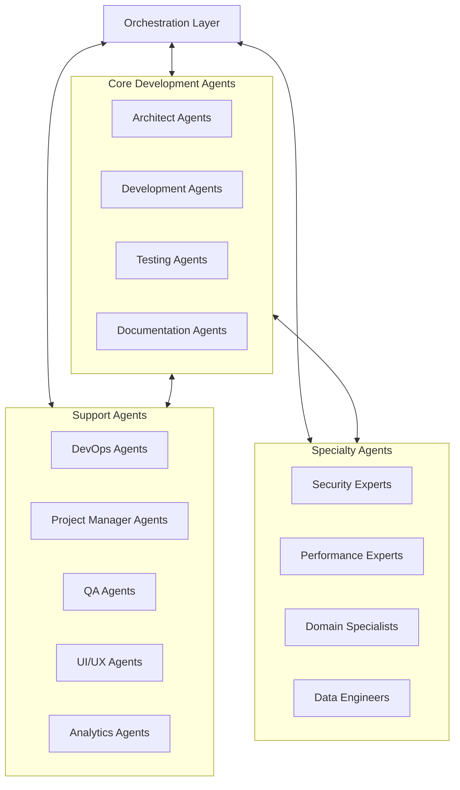

```mermaid
flowchart TD
    Orchestrator["Orchestration Layer"]
    
    subgraph Core_Development_Agents["Core Development Agents"]
        Architect["Architect Agents"]
        Dev["Development Agents"]
        Test["Testing Agents"]
        Doc["Documentation Agents"]
    end
    
    subgraph Support_Agents["Support Agents"]
        DevOps["DevOps Agents"]
        PM["Project Manager Agents"]
        QA["QA Agents"]
        UIUX["UI/UX Agents"]
        Analytics["Analytics Agents"]
    end
    
    subgraph Specialty_Agents["Specialty Agents"]
        Security["Security Experts"]
        Performance["Performance Experts"]
        Domain["Domain Specialists"]
        Data["Data Engineers"]
    end
    
    Orchestrator <--> Core_Development_Agents
    Orchestrator <--> Support_Agents
    Orchestrator <--> Specialty_Agents
    
    Core_Development_Agents <--> Support_Agents
    Core_Development_Agents <--> Specialty_Agents
```
