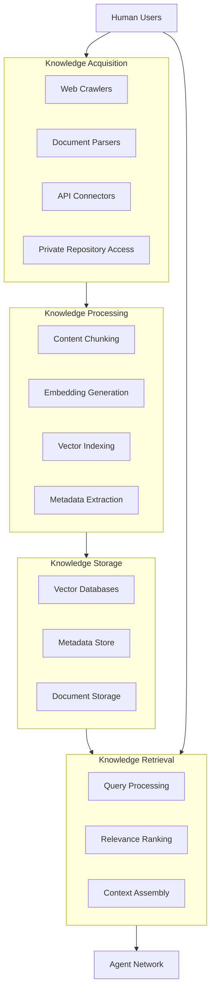

```mermaid
flowchart TD
    subgraph Knowledge_Acquisition["Knowledge Acquisition"]
        WebCrawlers["Web Crawlers"]
        DocParsers["Document Parsers"]
        APIConnectors["API Connectors"]
        PrivateRepos["Private Repository Access"]
    end
    
    subgraph Knowledge_Processing["Knowledge Processing"]
        Chunking["Content Chunking"]
        Embedding["Embedding Generation"]
        Indexing["Vector Indexing"]
        Metadata["Metadata Extraction"]
    end
    
    subgraph Knowledge_Storage["Knowledge Storage"]
        VectorDB["Vector Databases"]
        MetadataDB["Metadata Store"]
        BlobStorage["Document Storage"]
    end
    
    subgraph Knowledge_Retrieval["Knowledge Retrieval"]
        QueryProcessor["Query Processing"]
        RelevanceRanking["Relevance Ranking"]
        ContextAssembly["Context Assembly"]
    end
    
    Knowledge_Acquisition --> Knowledge_Processing
    Knowledge_Processing --> Knowledge_Storage
    Knowledge_Storage --> Knowledge_Retrieval
    Knowledge_Retrieval --> Agents["Agent Network"]
    
    Users["Human Users"] --> Knowledge_Acquisition
    Users --> Knowledge_Retrieval
```
