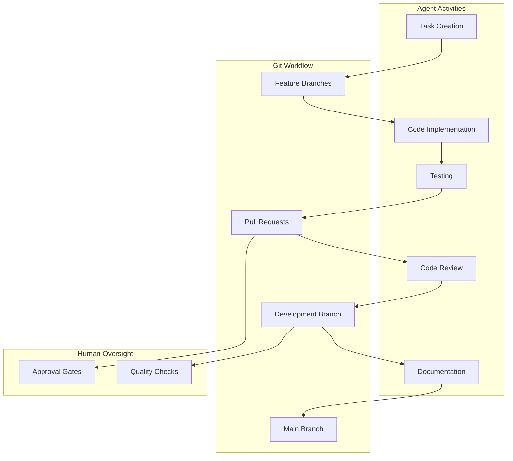

```mermaid
flowchart TD
    subgraph Git_Workflow["Git Workflow"]
        Main["Main Branch"]
        Dev["Development Branch"]
        Feature["Feature Branches"]
        PR["Pull Requests"]
    end
    
    subgraph Agent_Activities["Agent Activities"]
        TaskCreation["Task Creation"]
        CodeImplementation["Code Implementation"]
        Testing["Testing"]
        CodeReview["Code Review"]
        Documentation["Documentation"]
    end
    
    TaskCreation --> Feature
    Feature --> CodeImplementation
    CodeImplementation --> Testing
    Testing --> PR
    PR --> CodeReview
    CodeReview --> Dev
    Dev --> Documentation
    Documentation --> Main
    
    subgraph Human_Oversight["Human Oversight"]
        ApprovalGates["Approval Gates"]
        QualityChecks["Quality Checks"]
    end
    
    PR --> ApprovalGates
    Dev --> QualityChecks
```
