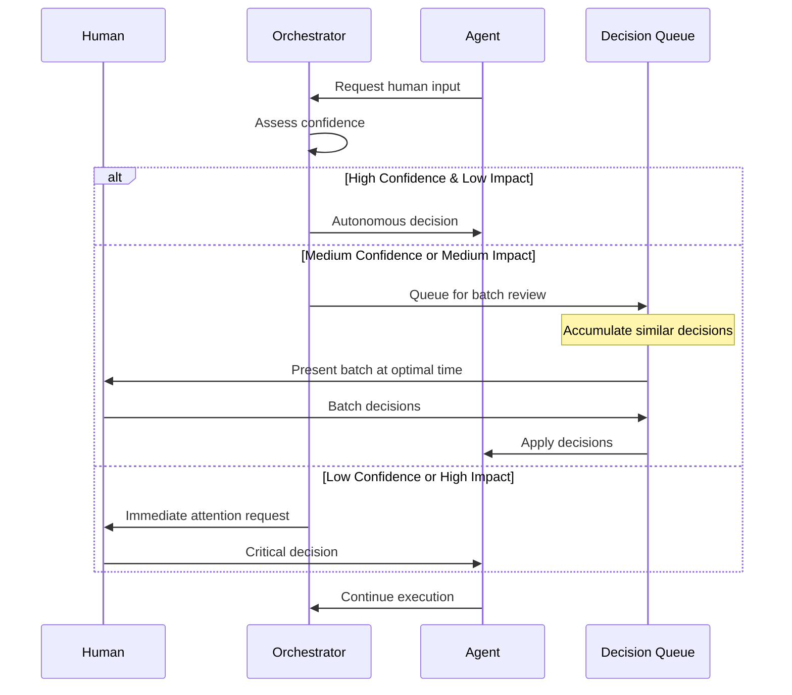

```mermaid
sequenceDiagram
    participant H as Human
    participant O as Orchestrator
    participant A as Agent
    participant Q as Decision Queue
    
    A->>O: Request human input
    O->>O: Assess confidence
    
    alt High Confidence & Low Impact
        O->>A: Autonomous decision
    else Medium Confidence or Medium Impact
        O->>Q: Queue for batch review
        Note over Q: Accumulate similar decisions
        Q->>H: Present batch at optimal time
        H->>Q: Batch decisions
        Q->>A: Apply decisions
    else Low Confidence or High Impact
        O->>H: Immediate attention request
        H->>A: Critical decision
    end
    
    A->>O: Continue execution
```
