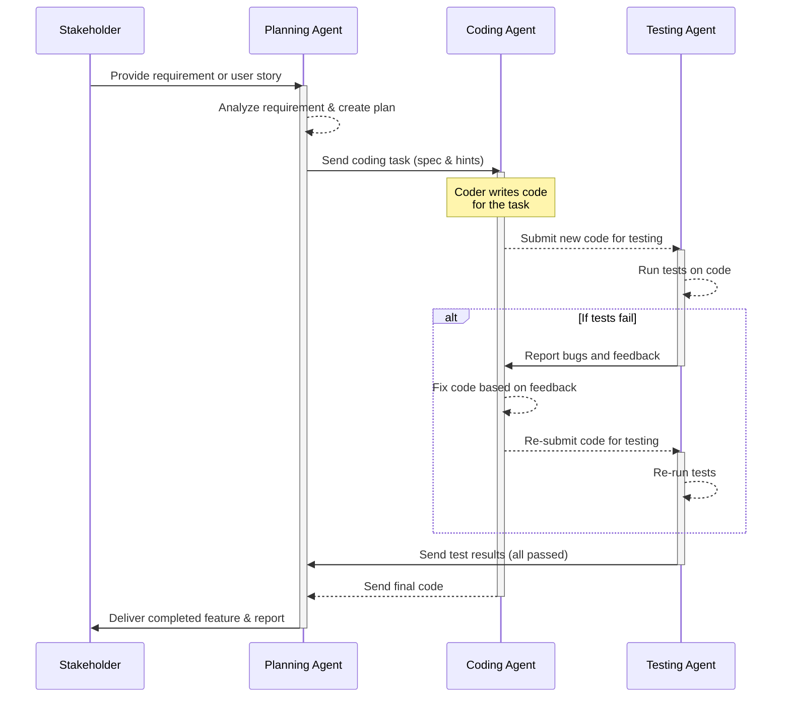

```mermaid
sequenceDiagram
    participant User as Stakeholder
    participant Planner as Planning Agent
    participant Coder as Coding Agent
    participant Tester as Testing Agent
    User->>Planner: Provide requirement or user story
    activate Planner
    Planner-->>Planner: Analyze requirement & create plan
    Planner->>Coder: Send coding task (spec & hints)
    activate Coder
    Note over Coder: Coder writes code<br/> for the task
    Coder-->>Tester: Submit new code for testing
    activate Tester
    Tester-->>Tester: Run tests on code
    alt If tests fail
        Tester->>Coder: Report bugs and feedback
        deactivate Tester
        Coder-->>Coder: Fix code based on feedback
        Coder-->>Tester: Re-submit code for testing
        activate Tester
        Tester-->>Tester: Re-run tests
    end
    Tester->>Planner: Send test results (all passed)
    deactivate Tester
    Coder-->>Planner: Send final code
    deactivate Coder
    Planner->>User: Deliver completed feature & report
    deactivate Planner
```
